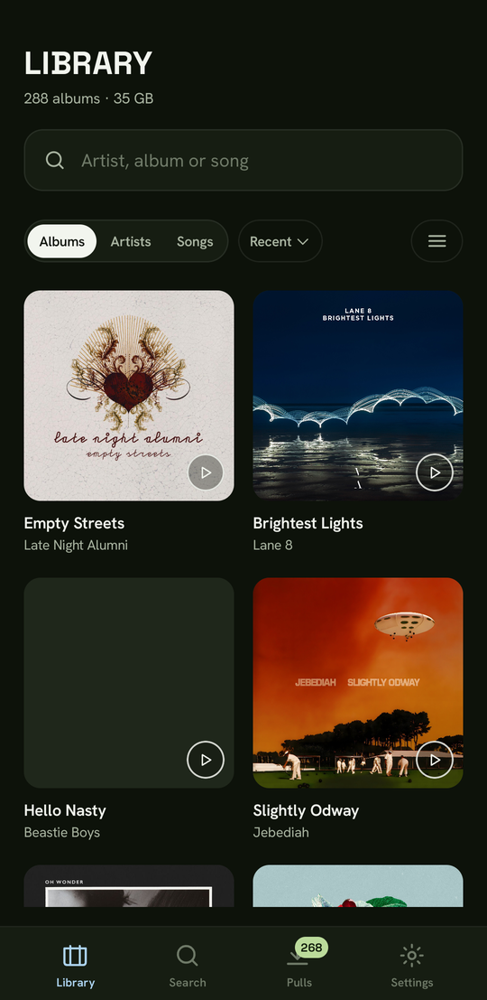

# Needler

An Android music player for a self-hosted [DroppedNeedle](https://github.com/DroppedNeedle/DroppedNeedle) server.

Browse and play your library, search the MusicBrainz catalogue, ask your server to pull albums you
don't own yet, and keep what you want playable offline.

Phone and tablet.



## Install

Download the latest `needler-vX.Y.Z.apk` from
[Releases](https://github.com/timothymumford1986/NeedleApp/releases) and open it on your phone.
Needs Android 8.0 or newer.

Android will ask whether to allow installs from wherever you downloaded it. That's per-app, and you
can take it back afterwards.

There's a `needler-wear-vX.Y.Z.apk` for Wear OS, which goes on over adb.

Releases are signed with the same key, so each one installs over the last and keeps your server and
your library.

## What works

Library, album and artist screens, with artwork, sorting, and a grid or list view.

Playback with a queue, shuffle, and lock-screen and notification controls. A mini-player above the
tabs, and the full player behind it.

On a tablet, or a phone in landscape, the player moves into a panel beside the library rather than
behind it.

Search over your library and the MusicBrainz catalogue at once. The pulls queue, with progress,
cancel and retry. Settings, including the equaliser and crossfade.

A home-screen widget, and the app updates itself from the latest release.

The library is mirrored on the phone, so it loads instantly and works with no connection.

## What doesn't

Offline downloads were keeping nothing at all until recently — playing a track while its album
pulled deleted the download in flight. That is fixed but has not yet been run on a phone, so treat
offline as working rather than proven.

The Wear app runs and will say the phone is unreachable, because the phone half of the link is not
written yet.

Artist discographies come back empty from the catalogue on every artist. The app now says which
kind of failure it was and writes it to the log, which is how it will get found.

No Android Auto.

## Roadmap

1. Find the discography failure, now that the app will tell you what it is
2. The phone side of the Wear link
3. A live poll on the pulls screen, so it updates while you watch it
4. Android Auto

## Build

JDK 21 and the Android SDK with `android-37.x`.

`compileSdk` is 37 because `okhttp-android` and the androidx libraries want it. `targetSdk` is 36
and `minSdk` is 26.

```
./gradlew test assembleDebug
```

`test` rewrites the committed screenshots unless you pass `-Pneedler.screenshots.verify`, which is
what CI does and what makes them regression tests. Record deliberate changes with the flag off, and
commit the result.

In a synced folder (OneDrive, Dropbox) the sync client holds handles on Gradle's output and the
build fails with "Unable to delete directory". Put `needler.buildDir=/some/path/outside/the/sync`
in `~/.gradle/gradle.properties`.

One catch worth knowing about. Debug builds are signed with the building machine's own debug
keystore, so a build from a second computer won't install over one from the first. Uninstalling to
get past that wipes the key holding your saved credentials, and you'll have to connect to the server
again.

Releases don't have that problem.

## How it works

Two surfaces on your own DroppedNeedle server:

- **OpenSubsonic** (`/subsonic/rest/*`) for library browsing, playback, playlists and favourites
- **The native API** (`/api/v1/*`) for catalogue search, pull requests and the download queue

Both are joined on the MusicBrainz release-group MBID. In short, an album you own and an album you
could pull are the same thing in two states.

| | |
| --- | --- |
| [REQUIREMENTS.md](REQUIREMENTS.md) | The spec and architecture, kept in step with the code |
| [design/](design/) | 21 screens as HTML and PNG — the UI source of truth |

## Stack

Kotlin 2.4.20, Jetpack Compose with adaptive layouts, Media3/ExoPlayer, Room, WorkManager, Hilt,
OkHttp, Coil. Built with AGP 9.4 and Gradle 9.6.

## Licence

[Apache-2.0](LICENSE). You may use, modify and redistribute this, including commercially, provided
you keep the notice and state your changes.

Needler talks to DroppedNeedle over HTTP and links none of its code, so DroppedNeedle's AGPL-3.0
does not extend to this project.

## Disclaimer

Needler is an independent client for a DroppedNeedle server that you install, configure and operate
yourself. It is not affiliated with, endorsed by or sponsored by DroppedNeedle, slskd, Soulseek,
MusicBrainz, ListenBrainz or any other service it talks to.

Needler does not host, store, index, search for or transmit any music. Every search, download and
stream is performed by your own server and the services you have connected to it, under your control
and your accounts.

You are solely responsible for what you search for, download and play, for holding the rights to do
so, and for complying with copyright law and the terms of every service you use.
