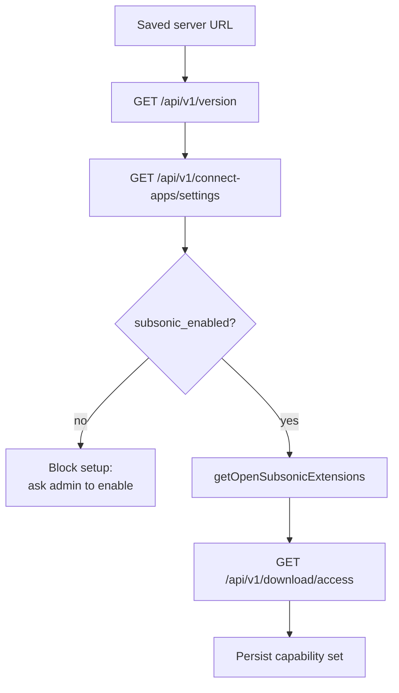
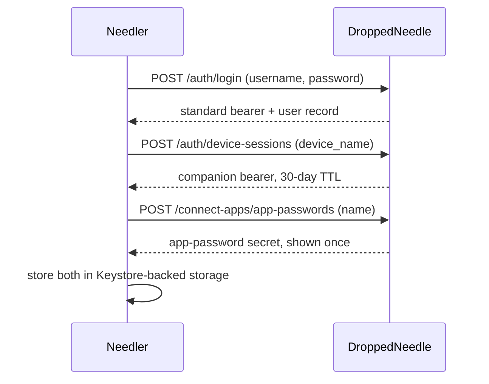
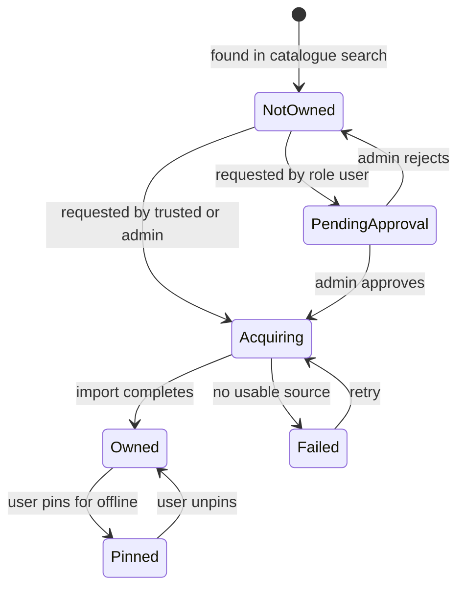
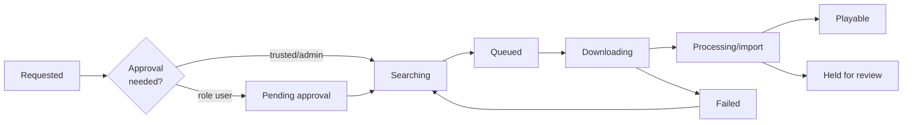
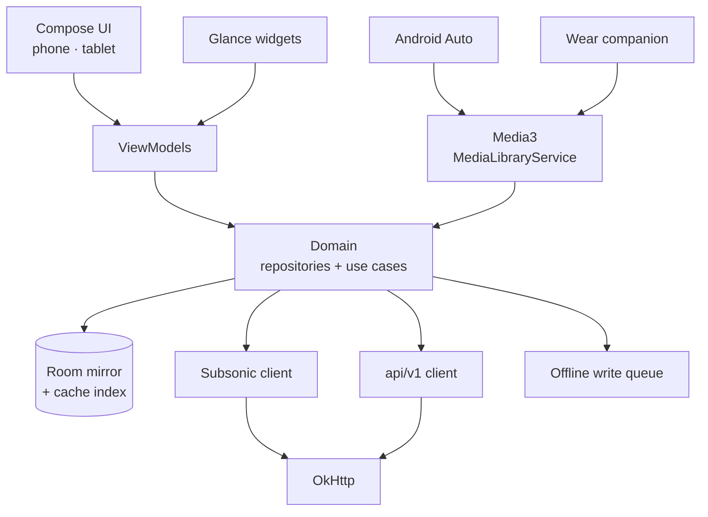

# Needler — Requirements & Architecture

Android music player for DroppedNeedle · 2026-09-17

## Scope

Needler is an Android phone and tablet client for a self-hosted [DroppedNeedle](https://github.com/DroppedNeedle/DroppedNeedle) server. Version 1 does four things: play the owned library, search the MusicBrainz catalogue, request missing albums, and keep chosen music playable offline.

Everything else DroppedNeedle offers — discovery feeds, artist following, concerts, library management, admin settings — is deliberately out of v1. Visual design is being produced separately and is not specified here.

The `design/` folder is the UI source of truth: 21 screens as HTML and PNG, plus a PDF, covering phone, tablet, lock screen, home-screen widgets and the audio settings. Requirements below cite those screens by name. Where a screen and the server's actual behaviour disagree, this document says so and proposes the amendment.

### Decisions already fixed

| Decision | Choice | Main consequence |
| --- | --- | --- |
| Server interface | OpenSubsonic for library and playback; `/api/v1` for search, requests and queue | Needs an admin to enable the Subsonic protocol once |
| Offline model | User-pinned content, plus an LRU cache of what was played | Two storage tiers with different eviction rules |
| Stack | Kotlin, Jetpack Compose, Media3 | Single-platform; best control of Range requests and caching |
| v1 feature set | Player, search, request, download queue | Discovery and admin surfaces deferred |
| Connectivity | One saved server, any URL form, opt-in trust of a self-signed certificate | User supplies their own VPN or reverse proxy for remote access |
| Notifications | Local, driven by periodic background polling | Best-effort delivery; no server push exists |
| Extra surfaces | Android Auto, Google Cast, Wear OS companion | Each carries a distribution constraint (see Surface integrations) |
| Distribution | Signed APK on GitHub releases | No store policy limits, but Auto and Wear need manual enablement |
| Player features | Gapless, crossfade, 10-band EQ, sleep timer, speed control | Crossfade and EQ need a custom Media3 audio pipeline |
| Audio cache | User-chosen size budget in app-private internal storage | No storage permissions; cleared on uninstall |

### Target devices

Minimum SDK 26 (Android 8.0), target SDK 36. Phone and tablet are one app on Compose window size classes: phone uses a bottom nav bar and a collapsed mini-player, tablet uses a left nav rail with a permanent right-hand player and queue sidebar.

Beyond the app itself, the design pack also specifies lock-screen media controls and three home-screen widgets (now playing, recently added, pull progress). The Wear OS companion is a separate module in the same repository.

## Design system

The palette is a single dark theme built on a near-black olive canvas, with one pale-blue accent and one pale-green positive state. No light theme exists in the design pack.

| Role | Value | Used for |
| --- | --- | --- |
| Canvas | `#0d120a` | App background |
| Surface | `#161d12` | Cards, inputs, sheets |
| Surface raised | `#1f271b` | Pressed and selected rows |
| Text primary | `#f2f5ee` | Titles, track names |
| Text secondary | `#a8b3a0` | Artists, metadata |
| Text muted | `#6f7a68` | Placeholders, disabled |
| Accent | `#aed5f2` | Primary buttons, links, transport |
| On accent | `#071520` | Text on accent fills |
| Positive | `#bbdb9b` | Progress, Ready, on-device check |
| On positive | `#0f1a0a` | Text on positive fills |
| Hairline | `rgba(242,245,238,0.08)` | Borders and dividers |

Type is two families. Space Grotesk at 500 and 700 carries the wordmark, screen titles, numerals and badges; the wordmark is uppercase at `0.04em` tracking. Hanken Grotesk at 400 to 700 carries all body text. Elapsed and remaining times use tabular numerals so they do not jitter.

Shape is 10 px for small chips, 14 px for inputs and cards, 16 to 18 px for buttons and sheets, 999 px for pills and 2 px for progress bars. Primary controls are 54 to 56 px tall.

### Motion

Launch plays a 2.1 s record spin-up with a tonearm drop, then the sign-in content rises in a 0.5 s stagger. A playing record mark spins on a 3.6 s linear loop.

Every one of these is suppressed under `prefers-reduced-motion` in the design pack. On Android that maps to `ANIMATOR_DURATION_SCALE` being zero, which Needler must check before starting the splash or any looping animation.

### Vocabulary

The product has its own words, and they must be used consistently across the UI, notifications, widgets and Android Auto.

| Term | Means |
| --- | --- |
| Pull | Ask the server to acquire an album you do not own |
| Pull local | Download an owned album to this device |
| In the crate | The play queue |
| On device | Cached locally, plays without a network |
| In library | Owned by the server, streams on demand |

## Server interface

DroppedNeedle exposes two HTTP surfaces, and Needler needs both. Neither one alone covers the product.

|  | `/api/v1/*` | `/subsonic/rest/*` |
| --- | --- | --- |
| Purpose | Search MusicBrainz, request music, download queue, approvals | Browse and play the owned library, playlists, favourites |
| Auth | `Authorization: Bearer <token>` | `apiKey=<app-password>` query parameter |
| Enabled by default | Yes | No — admin sets `subsonic_enabled` |
| Protocol | Bespoke, OpenAPI 3.1 at `/api/v1/docs` | OpenSubsonic 1.16.1 |
| Serves | All configured sources | The native local library only |

The compatibility layer is unusually complete. It implements `search3`, `getAlbumList2`, `getArtists`, `getAlbum`, `getCoverArt`, `stream`, `download`, playlist CRUD, `star`/`getStarred2`, `scrobble`, `getLyricsBySongId` and bookmarks. Advertised extensions are `apiKeyAuthentication`, `formPost` and `transcodeOffset`.

Four further extensions are implemented but not advertised, pending client certification: `songLyrics:1`, `playbackReport:1`, `indexBasedQueue:1` and `transcoding:1`. Needler must probe `getOpenSubsonicExtensions` and treat anything absent from the response as unavailable.

### Capability negotiation on connect

Needler targets no fixed DroppedNeedle version. It discovers what the server can do, once per connection, and disables features rather than failing.

The gate at `subsonic_enabled` is the one hard dependency on an administrator. A non-admin user on a server with the protocol switched off cannot finish onboarding, so the setup screen must say exactly which setting an admin has to turn on.

### Endpoints Needler consumes

| Concern | Calls |
| --- | --- |
| Connect | `GET /api/v1/version`, `GET /api/v1/status`, `GET /api/v1/connect-apps/settings` |
| Auth | `POST /api/v1/auth/login`, `POST /api/v1/auth/device-sessions`, `GET /api/v1/auth/me`, `POST /api/v1/connect-apps/app-passwords` |
| Catalogue search | `GET /api/v1/search`, `GET /api/v1/search/{bucket}`, `GET /api/v1/search/suggest` |
| Album and artist detail | `GET /api/v1/albums/{id}`, `GET /api/v1/albums/{id}/tracks`, `GET /api/v1/artists/{id}/releases` |
| Request | `POST /api/v1/requests/new`, `POST /api/v1/requests/batch`, `POST /api/v1/tracks/{recording_mbid}/request` |
| Queue | `GET /api/v1/downloads`, `GET /api/v1/downloads/activity-summary`, `POST /api/v1/downloads/{id}/cancel`, `POST /api/v1/downloads/{id}/retry` |
| Request states | `GET /api/v1/requests/active`, `GET /api/v1/requests/history`, `GET /api/v1/requests/wanted` |
| Library | `getArtists`, `getArtist`, `getAlbum`, `getAlbumList2`, `getGenres`, `search3` |
| Playback | `stream`, `download`, `getCoverArt`, `scrobble`, `getLyricsBySongId` |
| Playlists and stars | `getPlaylists`, `getPlaylist`, `createPlaylist`, `updatePlaylist`, `star`, `unstar`, `getStarred2` |

## Authentication

Onboarding is the single Connect screen from the design pack: server, username, one secret. One field's label has to change, for a reason set out at the end of this section.

The standard bearer from login is used only to mint the other two, then discarded. Requirements:

1. Log in with local credentials against `POST /api/v1/auth/login`. Only this method is in scope; OIDC, Plex and Jellyfin logins are deferred.
2. Mint a companion session named after the device, for example `Needler · Pixel 8`. It appears in the server's session list and the user can revoke it independently.
3. Create one app-password named `Needler`. The secret is returned exactly once and is never re-fetchable, so a failed write must abort and revoke.
4. Store both secrets in `EncryptedSharedPreferences` under a Keystore master key. Never write either to logs, crash reports or the metadata database.
5. Reuse the existing app-password on re-login if one named `Needler` is already listed, by revoking it and creating a replacement. The cap is 25 active per user.

### Expiry, and why playback survives it

The companion bearer expires 30 days after issue and does not slide on use. The app-password does not expire. These two facts produce a useful asymmetry that v1 should lean on rather than fight.

| Credential | Lifetime | What breaks when it expires |
| --- | --- | --- |
| Companion bearer | 30 days, fixed | Search, requesting, queue monitoring |
| App-password | Until revoked | Nothing — library, streaming and playlists keep working |

So an expired session degrades the app to a pure music player rather than bricking it. Needler must detect `401` on any `/api/v1` call, mark the session stale, keep playback fully functional, and show a non-blocking prompt to sign in again.

A companion session cannot mint another device session, so silent renewal is impossible without storing the password. Do not store the password; prompt instead. Warn in-app from day 25 so re-authentication is rarely a surprise.

### Roles and permissions

The user's role comes from `GET /api/v1/auth/me` and changes what the app may offer.

| Role | Requests | Library download |
| --- | --- | --- |
| `admin` | Execute immediately | Subject to the same setting |
| `trusted` | Execute immediately | Subject to the same setting |
| `user` | Queue for admin approval | Often disabled |

Offline downloads are separately gated by an administrator. Needler must call `GET /api/v1/download/access` and hide every pin and download affordance when `allowed` is false, rather than letting the action fail later.

### Required change to the Connect screen

Screens 01 and 16 label the third field `APP PASSWORD`. An app-password cannot authenticate the `/api/v1` lane: the bearer middleware validates only against the server's `auth_tokens` table, and app-passwords live in a separate store that only the Subsonic and Jellyfin shims consult.

So a user who enters an app-password gets a working music player with no search, no pull and no queue — which is most of the product missing.

The fix costs nothing visually. Keep the three fields exactly as designed and change the third label to `PASSWORD`, with helper text reading *your Dropped Needle account password*. Needler then mints the app-password itself, as in the sequence above, and the user never sees one.

The alternative — asking for both an account password and an app-password — adds a field, asks the user to visit the web UI first, and buys nothing.

## Identity model

The MusicBrainz release-group MBID is the join key that lets one screen show owned and un-owned music together. This is the single most load-bearing fact in the architecture.

DroppedNeedle's Subsonic IDs are type-prefixed and built from MBIDs, and its request API is keyed on the same MBIDs:

| Subsonic ID | Internal value | Also accepted by |
| --- | --- | --- |
| `al-<uuid>` | Release-group MBID | `POST /api/v1/requests/new` |
| `ar-<uuid>` | Artist MBID | `GET /api/v1/artists/{id}` |
| `tr-<id>` | Track file row ID | Nothing else |
| `pl-<id>` | Playlist ID | — |

Strip the `al-` prefix from a Subsonic album ID and you have the exact key the request endpoint takes. That means an album found by catalogue search and an album already in the library are the same domain object at different states.

### Album states

One `Album` entity carries this state. The UI never has separate "search result" and "library album" types, which removes a whole class of duplicate-rendering bugs.

Each state has one label, fixed by the design pack. Screens 03 and 10 show all four on the same list.

| State | Badge | Action offered |
| --- | --- | --- |
| `NotOwned` | none | **Pull** |
| `PendingApproval` | Waiting | none |
| `Acquiring` | Pulling, with percentage | Cancel |
| `Owned` | In library | Play, **Pull local** |
| `Pinned` | On device, green check on artwork | Play, remove from device |
| `Failed` | no source found | Retry |

### Track identity is not stable

A Subsonic track ID is `tr-<file_id>`, where `file_id` is a row ID in the server's track-files table. DroppedNeedle performs automatic quality upgrades, replacing files in place, and re-imports can also rewrite rows.

So `file_id` **must never be used as an offline cache key**. Cached audio is keyed on the tuple below, with `file_id` stored only as the current fetch handle.

- Release-group MBID
- Disc number and track number
- Recording MBID where the server provides one

On sync, if a track's `file_id`, size, duration or format has changed, the cached bytes are stale. Needler evicts them and re-downloads if the track is pinned. Without this rule, users silently keep listening to the lower-quality file they cached months ago.

## Browse and search

One search field queries both the owned library and the MusicBrainz catalogue, and results are merged by release-group MBID so nothing appears twice.

### Search behaviour

1. Typing issues `search3` against the local metadata mirror immediately, with no network call, so library results appear on the first keystroke.
2. After a 300 ms debounce, call `GET /api/v1/search?q=&limit_artists=&limit_albums=` for the catalogue, and `GET /api/v1/search/suggest` for completions.
3. Merge on release-group MBID. An album present locally takes the local record and is badged as owned; the catalogue copy is discarded.
4. Offline, or when the session has expired, show library results only and state plainly that catalogue search needs a connection.
5. Paginate a single bucket through `GET /api/v1/search/{artists|albums}` with `limit` and `offset`.
6. Cover art for catalogue results comes from `GET /api/v1/covers/release-group/{mbid}`; owned albums use `getCoverArt`.

Catalogue search hits MusicBrainz through the server and is slow relative to local search. Results must stream in progressively rather than blocking on the slowest bucket. The `service_status` field on the search response reports upstream degradation and should surface as a quiet inline note, not an error dialog.

### Library browse

All library browsing reads the local metadata mirror, so it works identically online and offline.

| Screen | Source | Ordering |
| --- | --- | --- |
| Artists | `getArtists` | Alphabetical, with index jump |
| Artist detail | `getArtist` plus `GET /api/v1/artists/{mbid}/releases` | Owned albums first, then un-owned |
| Album detail | `getAlbum` | Disc, then track number |
| Recently added | `getAlbumList2?type=newest` | Newest first |
| Most played | `getAlbumList2?type=frequent` | Server-computed |
| Genres | `getGenres`, `getSongsByGenre` | Alphabetical |
| Favourites | `getStarred2` | Recently starred first |
| Playlists | `getPlaylists` | Alphabetical |

Artist detail is where the two lanes meet visibly. It shows owned albums from the mirror and the artist's full discography from `GET /api/v1/artists/{mbid}/releases`, with everything un-owned carrying a request action.

### Playlists

Playlists are read and written through Subsonic: `getPlaylists`, `getPlaylist`, `createPlaylist`, `updatePlaylist`, `deletePlaylist`. Edits made offline queue locally and replay on reconnect, last-write-wins, since the protocol offers no revision or conflict signal.

`setRating` is a deliberate no-op on this server: it validates and returns success without persisting anything. Needler must not offer star ratings. Binary favourites via `star`/`unstar` do persist and are the supported mechanism.

## Request and acquire

Requesting is one tap on any un-owned album, and the app then tracks the album until it is playable. The user never needs to understand slskd, Usenet or indexers.

### Placing a request

| Action | Call | Notes |
| --- | --- | --- |
| Request an album | `POST /api/v1/requests/new` | Body carries `musicbrainz_id`, plus `artist`, `album`, `year` as hints |
| Request a single track | `POST /api/v1/tracks/{recording_mbid}/request` | Keyed on recording MBID, not release group |
| Request several albums | `POST /api/v1/requests/batch` | Up to 500 items; returns `requested`, `skipped`, `overflow` |
| Cancel before completion | `DELETE /api/v1/requests/active/{mbid}` |  |
| Retry a failed request | `POST /api/v1/requests/retry/{mbid}` |  |

The response returns `status`, which is `pending` or an approval state. Needler must render the status the server returned rather than inferring it from the cached role, because the role may have changed moments earlier. Requests placed while offline queue locally and submit on reconnect.

A `monitor_artist` flag on the request body subscribes the user to that artist's future releases. Expose it as a secondary toggle on the request sheet, since it is cheap here and would otherwise need the deferred following screens.

### Acquisition lifecycle

The server's download task statuses are `queued`, `downloading`, `processing`, `completed`, `partial`, `failed` and `cancelled`. Two further states are derived client-side, exactly as the web UI derives them:

- `queued` with no `search_job_id` means the server is still searching for sources. Show as **Searching**.
- `queued` with a `search_job_id` but no `candidate_index` means a manual source pick is parked. Show as **Needs attention on the server**.

### Queue screen requirements

1. Bucket tasks into Active, Completed and Failed, matching the server's own grouping, sorted newest first.
2. Show per-task progress from `progress_percent`, `downloaded_bytes` against `total_size_bytes`, and `files_completed` of `files_total`.
3. Allow cancel only while searching, queued or downloading. Cancellation during `processing` is unsafe because files are being moved, and the server refuses it.
4. Allow retry on `failed`, `cancelled` and `partial` tasks.
5. Surface `held_count` from the activity summary as a read-only notice. Held and quarantined items need the web UI in v1.
6. Show the user's own pending approvals from `GET /api/v1/requests/active`, with the waiting-for-approval state made explicit.

Live progress uses polling, not SSE. While the queue screen is foregrounded, poll `GET /api/v1/downloads` every 2 seconds; elsewhere in the app, poll `GET /api/v1/downloads/activity-summary`, which returns only `{revision, active_count, held_count, failed_count, landed_release_group_mbids}`. The `revision` field makes a no-change poll nearly free.

Per-task SSE at `GET /api/v1/downloads/{id}/stream` exists and is not used in v1. Holding open one connection per task keeps the mobile radio awake and scales badly against a queue of twenty albums.

## Playback

Playback runs through a single Media3 `MediaLibraryService`, so the lock screen, widgets, Android Auto, Bluetooth controls and Wear all drive the same session. The app's UI is one more client of that session, not the owner of the player.

### Streaming

By default Needler fetches original bytes with `stream?id=<track>&format=raw` and decodes on device. Media3 handles FLAC, MP3, AAC, Vorbis and Opus natively, which covers everything DroppedNeedle serves in practice.

This is a deliberate choice against server transcoding. The server allows one transcode per user and two in total, so a household with two listeners can exhaust it, and a Cast session plus a phone can collide with itself. Requirements:

1. Default stream quality is Original, matching screen 12.
2. "Stream on mobile data: MP3 320" requests a transcode with `format=mp3&maxBitRate=320` only while on a metered connection.
3. Hide that setting entirely unless `transcoding:1` appears in `getOpenSubsonicExtensions` and the server reports transcoding enabled. Neither is guaranteed; ffmpeg may be absent.
4. On `429` from a transcode, fall back to the original stream for that track and show a one-line notice rather than failing.
5. All audio requests must be `Range`-capable. The server honours ranges, returns `416` correctly, and disables gzip on audio so seeking works.

### Queue

The queue is "in the crate" (screens 08 and 09): a Playing row, an Up next list with a count and total duration, drag-to-reorder handles, and a Clear action. It lives on the device and persists across restarts.

Server-side queue sync via `savePlayQueue` is out of scope for v1. The endpoints and the `indexBasedQueue:1` extension exist, so this stays available later without server work.

### Player features

| Feature | Design reference | Implementation note |
| --- | --- | --- |
| Gapless | Settings toggle, on by default | Media3 concatenation; requires no re-buffer between tracks |
| Crossfade | Screen 20: off, 4 s, 6 s, 12 s | Two `ExoPlayer` instances with volume ramps |
| Skip fade inside an album | Screen 20 | Suppress crossfade when the next track shares the album, so gapless records stay intact |
| Fade on skip | Screen 20 | 1 s fade when the user presses next |
| Fade on pause | Screen 20 | Short ramp instead of an abrupt stop |
| Equaliser | Screen 19 | 10 bands at 31, 62, 125, 250, 500 Hz and 1, 2, 4, 8, 16 kHz; gain ±12 dB; plus a preamp |
| Sleep timer | Not drawn | End of track or a duration |
| Speed control | Not drawn | `0.5×` to `2×` |

The band frequencies and ±12 dB range match DroppedNeedle's web player exactly. The presets do not: the server ships Flat, Rock, Pop, Jazz, Classical, Bass Boost, Treble Boost, Vocal, Electronic and Acoustic, while screen 19 shows Flat, Bass, Vocal, Bright and Vinyl. Needler's five are the better mobile set, so keep them and change the screen's caption to claim the same *bands*, not the same presets.

EQ and crossfade both need a custom Media3 audio processor chain, which rules out the platform `Equalizer` effect. EQ state is stored per device, as screen 19 states, not synced to the server.

### Output

Screen 21 is a single "Play on" picker listing Cast devices, connected and nearby Bluetooth targets, and this device. It replaces the system output dialog because Cast targets must appear beside Bluetooth ones in one list.

The current output is always named in the player — "Living room speaker", "This tablet" — so a user never wonders where sound is going.

### Scrobbling

Call `scrobble` with `submission=false` on track start and `submission=true` past the halfway point. DroppedNeedle forwards to ListenBrainz or Last.fm according to the user's server-side preferences.

So the settings toggle governs whether Needler reports plays at all; the destination is the server's business. Read `GET /api/v1/me/scrobble-preferences` and label the toggle with whatever target is actually configured, rather than hard-coding ListenBrainz as screen 12 does. Scrobbles accrued offline are queued and submitted with their original timestamps on reconnect.

## Offline and caching

The whole UI works with no network. Metadata is fully mirrored, so browsing, search and queueing never wait on the server; only streaming un-cached audio and pulling new music need a connection.

### Three tiers

| Tier | Holds | Evicted |
| --- | --- | --- |
| Metadata mirror | Every artist, album, track, playlist, favourite | Never; refreshed by sync |
| Artwork cache | Album and artist art at display sizes | LRU, separate small budget |
| Audio | Pinned albums and recently played tracks | Pinned never; played by LRU |

One audio store serves both pinned and cached tracks, with a pin flag deciding eviction. Storing pinned downloads twice would double disk use for no benefit.

### Budget and storage

Screen 12 specifies the controls: current usage, a device storage limit, a toggle to keep pulled albums on device, and a destructive remove-all.

1. Audio lives in app-private internal storage. No permissions, and it is removed on uninstall.
2. The limit is user-set, defaulting to 4 GB as drawn. Offer 1, 2, 4, 8, 16 GB and unlimited.
3. Pinned content is exempt from the limit and from LRU eviction. If pins alone exceed the budget, warn rather than silently evicting what the user asked to keep.
4. "Keep pulled albums on device" auto-pins any album this device successfully pulled, so newly acquired music is already offline next time.
5. "Remove all from device" clears audio and artwork but never the metadata mirror, which would leave the app unable to browse.
6. Show real usage, as screen 12 does, split into pinned and cached so the user can see what a cleanup would actually free.

Downloads use per-track `Range` GETs against `download?id=`, which resume after interruption. Do not use `GET /api/v1/download/local/album/{id}`: it zips server-side, cannot resume, gives no per-track progress, and makes the server build an archive it then throws away.

### The Wi-Fi-only setting is mislabelled

Screen 12 lists "Pull on Wi-Fi only" under Pulling. A pull costs the phone nothing — the server does the downloading over its own connection, and the phone sends one small request.

What genuinely consumes mobile data is **Pull local**, downloading audio to the device. The setting should move to Storage and read "Download to device on Wi-Fi only", defaulting to on. Leaving it under Pulling would teach users that requesting music costs them data, which is false.

### Sync

Screens 09 and 12 show sync state: "last scan 47m ago", "Last synced 2 min ago", and a manual Sync now.

| Trigger | Scope |
| --- | --- |
| App foreground, mirror older than 15 min | Delta |
| Manual Sync now | Delta, forced |
| Background worker | Delta |
| First connect, or server identity changed | Full |

A delta sync calls `getIndexes` with `ifModifiedSince` set to the stored revision. An unchanged library returns almost nothing. When the revision has moved, pull changed artists, then `getAlbumList2?type=newest` for additions, then the affected albums.

`getScanStatus` supplies the "last scan" line, and `GET /api/v1/library/stats` the album count and library size in the header.

### Invalidating upgraded files

DroppedNeedle upgrades files in place when a better source appears, so cached audio can silently become the older, worse copy.

On every album sync, compare each track's `file_id`, size, duration and format against the cached record. Any difference means the bytes are stale: delete them, and re-download immediately if the track is pinned. This is the reason cache keys are built from release-group MBID, disc and track number rather than from `file_id`.

## Background work and notifications

DroppedNeedle has no push mechanism, so every notification comes from Needler polling on its own schedule. Screen 12 specifies three, each independently switchable.

| Notification | Source | Tapping it opens |
| --- | --- | --- |
| Pull finished | `landed_release_group_mbids` from the activity summary | The album, ready to play |
| Pull failed | `failed_count` rising, then the task list for detail | Pulls, on that item |
| New release from a followed artist | `GET /api/v1/following/new-releases/unseen-count` | The artist |

The third one pulls artist following into v1, which the feature scope had deferred. It is cheap: two endpoints for the count and the list, plus `POST /api/v1/following/new-releases/seen` to clear, and the `monitor_artist` flag already carried on the request body. The full following UI stays out.

### Polling schedule

| Condition | Interval | Mechanism |
| --- | --- | --- |
| Pulls screen foregrounded | 2 s | Coroutine, full task list |
| App foregrounded, elsewhere | 20 s | Coroutine, activity summary |
| Pull placed, app backgrounded | 1 min, then backing off to 15 min | Expedited `WorkManager` |
| Active pulls, app backgrounded | 15 min | Periodic `WorkManager` |
| No active pulls | 6 h | Periodic `WorkManager`, also drives metadata sync |

Fifteen minutes is the floor `WorkManager` allows for periodic work, so a pull that finishes soon after a poll can take that long to surface. Expediting the first check after a pull is placed covers the common case of a user waiting for something small.

The `revision` field on the activity summary makes an unchanged poll almost free, so the app can compare revisions and skip all downstream work when nothing has moved.

### Foreground service use

One foreground service, for media playback, owned by the Media3 session. Offline downloads run as expedited `WorkManager` jobs with a progress notification, not as a second foreground service.

### Delivery is best-effort

Doze, app standby buckets and aggressive OEM battery managers all delay or drop background work. Notifications must therefore be treated as a convenience, never as the only path to a piece of information.

The Pulls tab badge — the `2` drawn on every screen's nav — is the reliable channel: it reflects `active_count` plus unseen completions, and it updates whenever the app is opened.

## Connectivity and failures

One saved server, entered as a URL on the Connect screen. Remote access is the user's problem to solve with a VPN or a reverse proxy; Needler does not attempt hole-punching or discovery.

### Accepted URL forms

- `https://music.yourhome.net`, the placeholder on screen 01
- `http://192.168.1.50:8688`, plain HTTP on a local network
- `https://home.net/music`, a sub-path deployment, which the server supports through its `base_path` setting
- A port-only host with no scheme, defaulted to `http://` and port 8688

Normalise by trimming trailing slashes and probing `GET /api/v1/version` before accepting. A wrong URL must fail on the Connect screen, never later.

### Self-signed certificates

Many self-hosted servers use a self-signed or private-CA certificate. On a TLS failure, show the certificate's fingerprint, subject and expiry, and let the user pin that exact certificate for this server.

Pin the leaf certificate for the one host, never disable validation globally. A changed fingerprint must fail loudly and require re-confirmation.

### Failure handling

| Condition | Response |
| --- | --- |
| `401` on `/api/v1` | Mark session stale, keep playback working, prompt to sign in |
| `401` on Subsonic (code 40 or 44) | App-password revoked; require full re-onboarding |
| Subsonic `status=failed` code 0 | Protocol switched off; explain which setting an admin must enable |
| `429` with `Retry-After` | Honour the header, retry once, then fall back to the original stream |
| `416` on a range request | Cached length is wrong; discard and refetch |
| `403` on a download | Library download disabled by the admin; hide the affordance |
| Timeout or DNS failure | Treat as offline; serve the mirror and cached audio |
| `5xx` | Exponential backoff with jitter, capped at 5 minutes |

Offline is a first-class state, not an error. When the server is unreachable, the app plays on-device music, browses the full mirror, and queues pulls, playlist edits, favourites and scrobbles for replay.

### Write queue

Every mutation made offline is journalled and replayed in order on reconnect: pulls, playlist changes, star and unstar, scrobbles. Each entry carries a monotonic sequence and an attempt count, and is dropped after a permanent rejection with a notice to the user.

A pull for an album that arrived by other means while offline is discarded silently rather than replayed.

## Surfaces beyond the app

Six surfaces share the one Media3 session. Each is listed with the constraint that comes with it, because two of them conflict with shipping only a GitHub APK.

| Surface | Design reference | Constraint |
| --- | --- | --- |
| Phone | Screens 01–08, 13, 19–21 | — |
| Tablet | Screens 09–11, 16–18 | — |
| Lock screen | Screens 14, 17 | — |
| Home-screen widgets | Screens 15, 18 | — |
| Android Auto | Not drawn | Sideloaded apps need "Unknown sources" enabled in Auto's developer settings |
| Google Cast | Screen 21 | Receiver must reach the server independently |
| Wear OS | Not drawn | Normally distributed through Play; sideloading needs adb |

### Tablet layout

Screen 09 sets the structure: a left nav rail with Library, Search, Pulls and Settings; a content pane with a header, a search field, segmented tabs, a sort control and a grid/list toggle; and a permanent right sidebar holding large artwork, the transport, the output selector and the crate.

The grid is four columns on a tablet and two on a phone. The phone collapses the sidebar into a mini-player above the bottom nav, and the crate becomes a separate screen.

This is one navigation model at two widths, driven by `WindowSizeClass`. Nothing is tablet-only, so no feature needs building twice.

### Widgets

Screens 15 and 18 specify three, built with Glance:

1. Now playing — artwork, title, artist, position and transport controls.
2. Recently added — the newest album, tappable straight into it.
3. Pulls — the active pull with its percentage.

Widgets read the metadata mirror and the session directly. They must render sensibly with no network and no active playback, since that is their most common state.

### Android Auto

The browse tree mirrors the app: Library with albums, artists and songs; Recently added; Playlists; Favourites; On device. Voice search maps to the same unified search, restricted to owned music, since pulling while driving makes no sense.

Auto needs `MediaLibraryService` browse and search from the start. Retrofitting it later means restructuring playback, which is why it belongs in v1 even though it is not drawn.

### Cast, and where it breaks

A Cast receiver fetches audio itself, so it needs a URL it can reach and a certificate it will accept. Three of the setups this document explicitly supports defeat that:

- A VPN-only server, which the receiver is not on
- A self-signed certificate, which the receiver will not accept
- A plain-HTTP server, which a receiver may refuse as mixed content

Cast is therefore a best-effort feature. Probe reachability before offering a Cast target, and when it cannot work, say why in the output picker rather than failing after the user picks a speaker. Cast also consumes a server stream slot independently of the phone, which matters against the two-transcode ceiling.

### Wear OS

A separate module. v1 scope is transport controls, the crate, and playback of on-device audio synced from the phone over the data layer. Search and pulling are not on the watch.

Realistically this wants Play Store distribution. Sideloading a Wear APK over adb is beyond most users, so either Wear ships later alongside a store listing, or it is accepted as a developer-only surface for now.

## Architecture

The two server lanes are hidden behind one domain layer. No screen, and no player component, knows whether a fact came from Subsonic, from `/api/v1`, or from the local mirror.

The mirror is the read path. Repositories serve every query from Room and write to it from sync, so the UI never awaits a network call to render, and offline needs no separate code path.

### Modules

| Module | Contains |
| --- | --- |
| `:app` | Navigation, DI wiring, Connect and Settings |
| `:core:design` | Palette, type, shape, motion, shared components |
| `:core:domain` | Entities, repository interfaces, use cases |
| `:core:data` | Room, sync, write queue, repository implementations |
| `:core:network` | OkHttp, Subsonic and v1 clients, certificate pinning |
| `:feature:library` | Library, artist, album screens |
| `:feature:search` | Unified search |
| `:feature:pulls` | Request and queue screens |
| `:feature:player` | Now playing, crate, EQ, crossfade, output |
| `:player:service` | `MediaLibraryService`, audio processors, cache, Auto browse tree |
| `:widget` | Glance widgets |
| `:wear` | Wear companion |

### Libraries

| Concern | Choice | Why this one |
| --- | --- | --- |
| UI | Compose, Material 3 adaptive | One codebase across both widths |
| Player | Media3 `ExoPlayer` and `MediaLibraryService` | Range, gapless, caching and Auto in one stack |
| Audio cache | Media3 `CacheDataSource` with `SimpleCache` | Byte-range caching already solved |
| HTTP | OkHttp with a Media3 datasource | One client, one cert-pinning policy |
| Serialisation | `kotlinx.serialization` | Subsonic JSON and v1 both |
| Database | Room with FTS4 | Offline search over the mirror |
| Background | `WorkManager` | Polling and downloads |
| DI | Hilt | Standard, and Glance and services integrate cleanly |
| Images | Coil 3 | Disk cache with size budget |
| Settings | `DataStore` preferences, `EncryptedSharedPreferences` for secrets | Keystore-backed credentials |

### Where the two lanes meet

Only two places in the code need to know both lanes exist.

First, `AlbumRepository` composes an artist's owned albums from the mirror with the discography from `GET /api/v1/artists/{mbid}/releases`, joining on release-group MBID and emitting one list of `Album` with a state field.

Second, `SearchRepository` merges local FTS results with catalogue results on the same key. Everything else — every screen, the widgets, Auto, Wear — consumes one already-unified model.

## Local persistence

One Room database holds the mirror, the pins, the cache index and the write queue. Secrets never go in it.

| Table | Key | Notable columns |
| --- | --- | --- |
| `artist` | Artist MBID | name, sort name, album count, art URL |
| `album` | Release-group MBID | artist MBID, title, year, track count, duration, format, bitrate, state, added-at, size |
| `track` | Release-group MBID + disc + track no | title, duration, recording MBID, `file_id`, size, format, bitrate |
| `album_fts` | — | FTS4 over album title and artist name |
| `track_fts` | — | FTS4 over track title |
| `playlist`, `playlist_track` | Playlist ID | name, track count, duration, position |
| `favourite` | Entity type + ID | starred-at |
| `pin` | Release-group MBID | pinned-at, source (manual or auto-pulled), download state |
| `audio_cache` | Track key | byte size, last played, pinned flag, file path, source `file_id` |
| `pull` | Release-group MBID | task ID, status, percent, files done, files total, source, error, created-at |
| `write_queue` | Sequence | operation type, payload, attempts, last error |
| `sync_state` | Singleton | library revision, last full sync, last delta sync, last scan time |

### Notes on the schema

The `album.format` and `album.bitrate` columns exist because screen 13 badges every row with FLAC, MP3 320 or MP3 256. That comes from the tracks, so it is denormalised onto the album to keep list rendering cheap.

`album.size` and the album count feed the "176 albums · 42 GB" header on screens 02, 09 and 13. The server's `GET /api/v1/library/stats` gives authoritative totals; the local sum is the offline fallback.

`track.file_id` is stored but never used as a key. It is the current fetch handle and the staleness signal, nothing more.

`audio_cache.pinned` is what makes one store serve both tiers. Eviction scans unpinned rows by `last_played` ascending until usage fits the budget.

### Secrets and migrations

The companion bearer and the app-password live in `EncryptedSharedPreferences` under a Keystore master key, outside Room, and are excluded from any backup or crash report.

Migrations are written by hand from the first release, since a destructive fallback would throw away a multi-gigabyte cache and force a full re-sync. Changing server identity drops the mirror and the cache deliberately, because MBIDs are global but `file_id` values and playlist IDs are not.

## Non-functional requirements

### Performance budgets

| Measure | Target |
| --- | --- |
| Cold start to library content | Under 1.2 s, mid-range 2022 phone |
| Local search results | Under 50 ms for 10,000 albums |
| Play from tap, cached | Under 150 ms |
| Play from tap, streamed | Under 800 ms to first audio |
| Scroll | No dropped frames on a 5,000-album grid |
| Delta sync, unchanged library | One request, under 100 ms |

The splash animation runs 2.1 s, longer than cold start should take. It must overlay a screen already loaded underneath and be skippable by a tap, so it never becomes the reason the app feels slow.

### Battery and data

1. No background polling when no pulls are active and notifications are off, beyond the six-hourly sync.
2. No long-lived connections while backgrounded.
3. Respect Data Saver: no artwork prefetch, no speculative buffering, no metered sync when restricted.
4. Downloads to device default to Wi-Fi only.

### Accessibility

Every control carries a content description and transport controls are at least 48 dp. Text must scale to 200% without clipping, which the fixed 54 to 56 px control heights in the design pack will need care to honour.

Contrast must meet WCAG AA on the specified palette. The muted `#6f7a68` on the `#0d120a` canvas is the risk: it carries placeholders and metadata throughout the pack, and should be measured and lightened if it fails.

Motion honours the reduced-motion setting. TalkBack must reach the crate's reordering through an accessible action, not only by dragging.

### Security

1. Credentials in Keystore-backed storage, never in logs, analytics or crash reports.
2. Certificate pinning scoped to the one host the user pinned.
3. `android:allowBackup="false"`, so secrets and pins never leave the device.
4. No third-party analytics or crash reporting that transmits server URLs or library contents.
5. Release builds obfuscated, with `minifyEnabled` and no debug logging.

### Legal and attribution

Screen 12 carries the disclaimer text, and it is a requirement rather than decoration. It states that Needler is independent and unaffiliated, that it hosts and transmits no music, that the user is responsible for what they acquire, and that the app is provided without warranty.

The attribution line credits Dropped Needle, slskd, MusicBrainz, ListenBrainz and Cover Art Archive. A Licences screen must list every bundled dependency and its licence.

DroppedNeedle is AGPL-3.0, but Needler talks to it only over HTTP and links none of its code, so no copyleft obligation attaches to Needler itself. Needler's own licence is still to be chosen.

### Observability

A local, user-viewable diagnostics log covering the last session: request URLs with secrets redacted, status codes, sync summaries and playback errors. It must be shareable as a file for bug reports, and it must never leave the device automatically.

## Constraints and risks

Eight things in the server, and five in the design pack, constrain what Needler can ship. All were found by reading the DroppedNeedle source rather than its documentation.

### Server constraints

| Constraint | Effect | Mitigation |
| --- | --- | --- |
| `subsonic_enabled` defaults off, admin-only | A non-admin cannot finish onboarding | Detect it and name the exact setting an admin must turn on |
| Transcoding capped at 1 per user, 2 global | "MP3 320 on mobile data" collides with a second device or a Cast session | Default to original bytes; fall back on `429` |
| Direct streams capped at 8 per user, 32 global | Downloads competing with playback can hit the ceiling | Serialise downloads; keep one slot free for playback |
| Library download is admin-gated | Pull local may be unavailable entirely | Check `download/access` and hide the affordance |
| Track `file_id` changes on quality upgrade | Cached audio silently goes stale | MBID-based cache keys plus a staleness check on sync |
| Companion bearer expires hard at 30 days | Search and pulls stop working, with no silent renewal | Degrade to player-only; warn from day 25 |
| Requests from role `user` need approval | A pull may sit waiting with no visible progress | Render the server's returned status; show Waiting |
| `setRating` is a validated no-op | Star ratings would silently do nothing | Offer only binary favourites |

### Design pack discrepancies

| Screen | Issue | Proposed fix |
| --- | --- | --- |
| 01, 16 | `APP PASSWORD` cannot reach the request API | Relabel to `PASSWORD`; mint the app-password internally |
| 12 | "Pull on Wi-Fi only" implies pulls cost phone data | Move to Storage as "Download to device on Wi-Fi only" |
| 12 | "Prefer FLAC" is not settable per request | Show the server's quality policy read-only, or admin-only |
| 12 | "Scrobble to ListenBrainz" hard-codes a destination | Label from the server's configured scrobble targets |
| 05 | "Dropped Needle picks the best Soulseek source" | Source-aware copy; the server also supports Usenet |

"Prefer FLAC" is the one worth explaining. The request body carries no quality field: `POST /api/v1/requests/new` accepts only the MBIDs, title hints and the two artist-monitoring flags. Quality is a server-side policy under `/api/v1/download-clients/policy`, which is admin-only to change.

The response does return `quality_snapshot_summary`, the policy applied to that request. So Needler can honestly show what quality will be sought, and can let an admin edit the policy, but a regular user cannot override it per album. Presenting it as a user toggle would be a lie.

### Open risks

1. **OEM battery managers** may suppress background polling entirely on some devices, making pull notifications unreliable. The Pulls badge is the fallback, and the app should not promise timely notifications.
2. **Cast is unreachable** in exactly the network setups this app expects, as set out above. It may prove not worth shipping.
3. **Wear distribution** effectively needs Play, which conflicts with the APK-only decision.
4. **No OpenAPI codegen at build time**, since the spec is served by a running server rather than published. Clients are hand-written against a spec snapshot, which must be refreshed deliberately when the server updates.
5. **Compat endpoints marked `partial`** in the server's own capability matrix may deviate in edge cases. `getAlbumList2`, `getRandomSongs`, `star` and `scrobble` all carry that marking and need testing against a real server rather than trusting the protocol.

## Out of scope

Everything below exists on the server and is deliberately absent from v1.

| Deferred | Server support that already exists |
| --- | --- |
| Discovery feeds, trending, weekly mixes | `/api/v1/home`, `/api/v1/discover` |
| Following UI, concerts, new-release radar | `/api/v1/following` — except the notification, which is in v1 |
| Manual source selection for a parked pull | `/api/v1/downloads/search/*` |
| Held and quarantine review | `/api/v1/downloads/held`, `/api/v1/quarantine` |
| Library management, tagging, reviews | `/api/v1/library/*` |
| Admin settings, users, approvals of others | `/api/v1/settings`, `/api/v1/auth/admin/*` |
| Drag-and-drop import of purchased files | `/api/v1/import` |
| Server-side play-queue sync | `savePlayQueue`, `indexBasedQueue:1` |
| Multiple server profiles | — |
| OIDC, Plex and Jellyfin sign-in | `/api/v1/auth/oidc`, `/plex`, `/jellyfin` |
| Lyrics display | `getLyricsBySongId`, `songLyrics:1` |
| Year-in-review | `/api/v1/wrapped` |

### Ordering for v2

1. Lyrics, which is one endpoint and one panel on the now-playing screen.
2. Server-side queue sync, so the crate follows you between Needler and the web player.
3. Manual source selection, which unblocks the parked-pull state the Pulls screen can currently only report.
4. Following UI, which the notification already half-implies.
5. OIDC sign-in, needed by anyone running SSO.
6. Multiple server profiles.

Lyrics is arguably a v1 cut given it costs almost nothing, but the design pack has no place for it on screen 07, so it waits for a design.

## Assumptions and open questions

### Assumptions made

1. The DroppedNeedle server uses its **native local library**, not an outbound Navidrome, Jellyfin or Plex source. The Subsonic shim exposes only DroppedNeedle's own folder, so a Plex-backed install would need the v1 native lane instead.
2. No minimum server version is set. Needler negotiates capabilities at runtime and needs only `/auth/device-sessions` and `/connect-apps/app-passwords` to exist.
3. The user can get an admin to enable the Subsonic protocol once, or is an admin.
4. Library sizes are in the low thousands of albums. Above roughly 50,000 the full metadata mirror would need revisiting.
5. Needler is single-user per device install. No profile switching.

### Open questions

1. **Does your server's Subsonic protocol get enabled, or should v1 also implement the `/api/v1` native playback lane as a fallback?** The hybrid choice assumes yes. A fallback is roughly 1.5x the data-layer work.
2. **Is "Prefer FLAC" acceptable as a read-only display of the server's policy**, or should it be an admin-only editable control?
3. **Should Cast ship in v1** given it cannot work on a VPN-only or self-signed server, which is the likely setup?
4. **Should Wear wait** for a Play Store listing, or ship as a sideloaded developer surface?
5. **What licence** does Needler itself carry? The Licences screen needs an answer.
6. **Is the crossfade preview on screen 20 live audio** or an illustration? Live cross-track preview needs the full dual-player pipeline running inside a settings screen.
7. **Should a failed pull retry automatically?** Screen 06 shows a manual Retry only.

### Sources

All server behaviour in this document was read from source at `main`, September 2026.

| Claim | Location |
| --- | --- |
| Subsonic endpoint coverage and deviations | [`capability_matrix.json`](https://github.com/DroppedNeedle/DroppedNeedle/blob/main/backend/api/compat/subsonic/capability_matrix.json) |
| Bearer validation excludes app-passwords | [`backend/middleware.py`](https://github.com/DroppedNeedle/DroppedNeedle/blob/main/backend/middleware.py) |
| Device sessions, 30-day token lifetime | [`routes/auth.py`](https://github.com/DroppedNeedle/DroppedNeedle/blob/main/backend/api/v1/routes/auth.py) |
| App-password provisioning and cap | [`connect_apps_routes.py`](https://github.com/DroppedNeedle/DroppedNeedle/blob/main/backend/api/v1/routes/connect_apps_routes.py) |
| Stream and transcode concurrency limits | [`stream_concurrency.py`](https://github.com/DroppedNeedle/DroppedNeedle/blob/main/backend/services/compat/stream_concurrency.py) |
| Range support and `format=raw` | [`subsonic/router.py`](https://github.com/DroppedNeedle/DroppedNeedle/blob/main/backend/api/compat/subsonic/router.py) |
| ID prefixes and MBID mapping | [`subsonic/ids.py`](https://github.com/DroppedNeedle/DroppedNeedle/blob/main/backend/api/compat/subsonic/ids.py) |
| Request body and approval status | [`schemas/request.py`](https://github.com/DroppedNeedle/DroppedNeedle/blob/main/backend/api/v1/schemas/request.py) |
| Download states and derivation | [`downloadStatus.ts`](https://github.com/DroppedNeedle/DroppedNeedle/blob/main/frontend/src/lib/queries/downloads/downloadStatus.ts) |
| EQ bands, gain range, presets | [`eqPresets.ts`](https://github.com/DroppedNeedle/DroppedNeedle/blob/main/frontend/src/lib/stores/eqPresets.ts) |
| Protocol enablement defaults | [`compat/common/enablement.py`](https://github.com/DroppedNeedle/DroppedNeedle/blob/main/backend/api/compat/common/enablement.py) |

UI requirements come from the 21 screens in `design/`, cited by number throughout.
