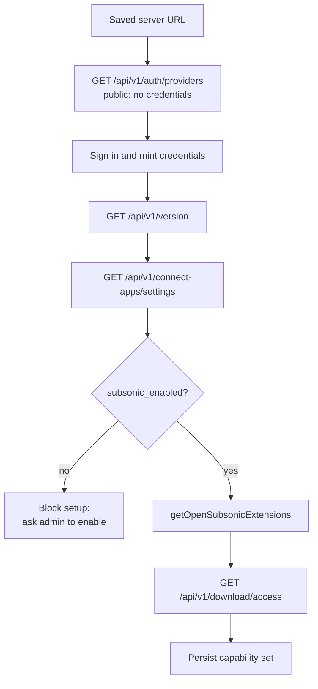
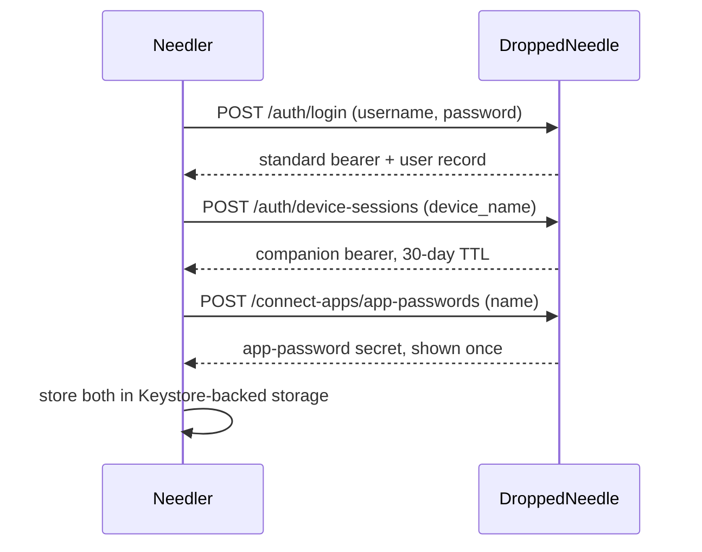
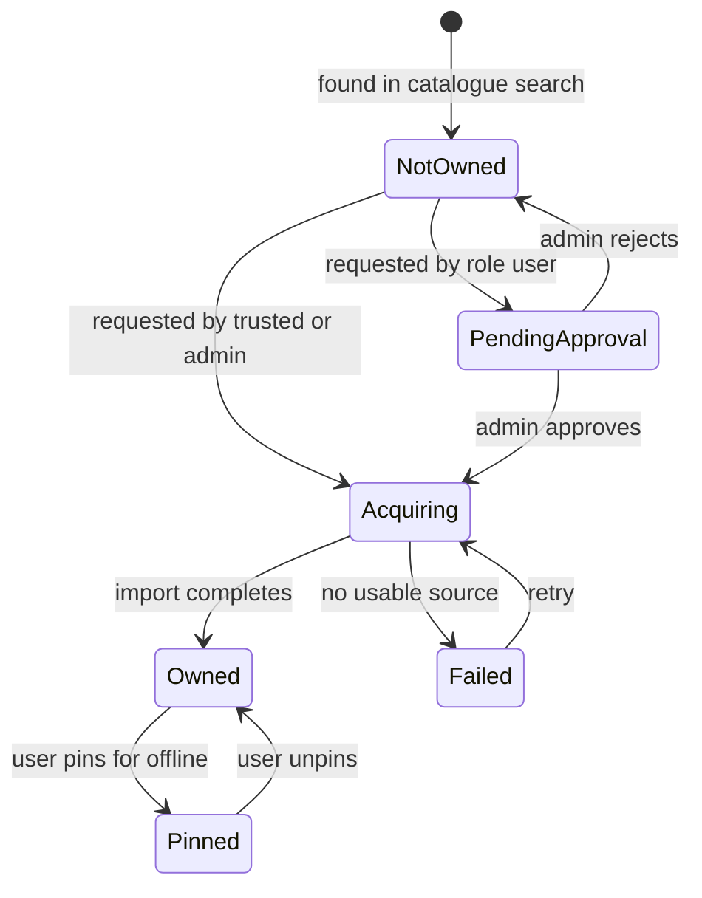
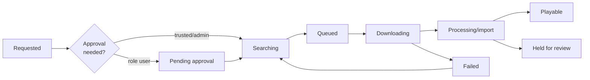
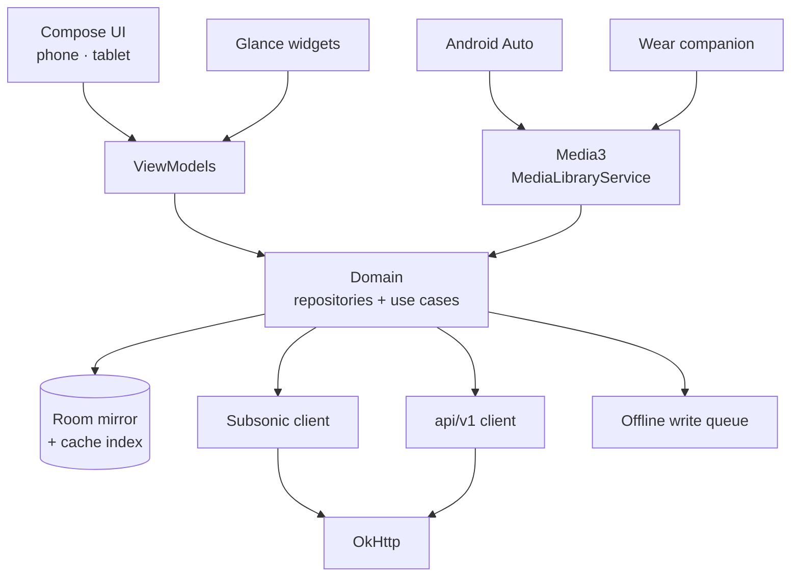

# Needler — Requirements & Architecture

Android music player for DroppedNeedle · drafted 2026-09-17 · revised 2026-09-18 · revised 2026-10-02 · revised 2026-10-03

> **As of 2026-09-18 this file is the canonical copy of Needler's requirements, and it is maintained alongside the code.** The first draft was written before any code existed. Five foundation modules have since been built against the DroppedNeedle source, and a good deal of what follows was found to be wrong, or too vague to implement. Those passages are corrected in place, and the correction is spelled out wherever the reasoning matters more than the conclusion. A change here is a change to the contract for the work that remains, so it belongs in the same commit as the code that makes it true.

> **The 2026-10-03 revision is a vocabulary cut, and it lands with the code that makes it true.** "Vocabulary" had nine words for three facts and is now three words, three actions and two retention tiers, each group under its own heading so that the shape of the model is visible from the table. "Design system", "Album states", "Request and acquire", "Offline and caching", "Partial content is a normal state", "Accessibility" and "Design pack discrepancies" are corrected in place to match, and two of the pack's colour decisions are overturned with the reasoning recorded rather than the conclusion alone. Nothing is appended as errata: a reader who starts at the top should never meet a retired word except where this file is explaining that it retired it.

> **The 2026-10-02 revision is a catch-up, and the rule above is what it broke.** Roughly 45,000 lines landed in the week to 2026-10-01 — the remaining feature surfaces, a device audit's worth of fixes — and this file was left untouched throughout, so for a week the canonical copy of the requirements was the one document in the repository known to be wrong. Every claim below is now checked against the tree rather than against the last revision. The lesson is the rule, not an exception to it: a surface that ships without its paragraph here leaves the next reader trusting a sentence the code stopped honouring.

## Scope

Needler is an Android phone and tablet client for a self-hosted [DroppedNeedle](https://github.com/DroppedNeedle/DroppedNeedle) server. Version 1 does four things: play the owned library, search the MusicBrainz catalogue, request missing albums, and keep chosen music playable offline.

Everything else DroppedNeedle offers — discovery feeds, artist following, concerts, library management, admin settings — is deliberately out of v1. Visual design is being produced separately and is not specified here.

The `design/` folder is the UI source of truth: 21 screens as HTML and PNG, plus a PDF, covering phone, tablet, lock screen, home-screen widgets and the audio settings. Requirements below cite those screens by name. Where a screen and the server's actual behaviour disagree, this document says so and proposes the amendment.

### Where the build has reached

All twelve modules carry code: `:core:domain`, `:core:data`, `:core:network`, `:core:design`, `:feature:library`, `:feature:search`, `:feature:pulls`, `:feature:player`, `:player:service`, `:widget`, `:wear` and `:app`. Together they are roughly 85,800 lines of production Kotlin across 395 files, with 38,000 lines of tests behind them; 1,714 tests pass across all twelve modules, and 180 screenshots are committed as regression baselines. `app-debug.apk` and `wear-debug.apk` both assemble.

There is exactly one instrumented test, `SecureCredentialStoreKeystoreTest` in `:core:data`. It is on a device because the thing it exercises — which Keystore failure means the credentials are unrecoverable — has no honest JVM stand-in. Everything else runs on the JVM, screenshots included: Roborazzi renders Compose through Robolectric, so a baseline is a unit test and CI needs no emulator for it.

**The app plays music, and every feature module now has screens in the graph.** Connect it to a server and you get the library in three tabs, album and artist detail, genres, playlists, favourites, unified search, the pulls screen, settings with its equaliser and crossfade sub-screens, a licences screen, a diagnostics log, a mini-player, a full now-playing screen with its crate, the tablet and landscape sidebar, lock-screen and notification transport, three home-screen widgets, an Android Auto browse tree, and a Wear companion that mirrors the session and plays audio synced from the phone. The library reads from the local mirror, so it renders in full with no network.

Two surfaces exist in the code and are specified nowhere in this document. Both are listed here rather than written up as requirements, because neither has had its contract decided: an in-app update check against GitHub releases, which an APK-distributed app needs because it has no store to deliver one, and an optional edge-proxy disclosure on the Connect screen that sends fixed headers with every request under three presets — Cloudflare, basic auth, and a raw editor.

What remains is small, and most of it is one control.

| Remaining | Where |
| --- | --- |
| Bluetooth sinks in the output picker | `:player:service` must supply the `AudioManager` device list |
| Cast receivers, and the reachability probe in front of them | `:player:service`; `OutputTarget.Cast` and `CastAvailability` are modelled and unpopulated |
| The output chip on the tablet sidebar | `:app`; the sheet that Now Playing's chip opens has no equivalent host there yet |
| A device run of the audio-retention fix | See "Offline and caching" |

**The three player sub-screens are registered now, and the correction is in how.** The first draft of this section said the equaliser, the crossfade screen and the output picker were "built but registered nowhere, because each needs a host decision first", and it treated them as one problem. They were two. The equaliser and crossfade are ordinary destinations and are reached from Settings. The output picker is not a destination at all: `OutputPickerRoute` draws its own dimmed backdrop and takes no dismiss callback, so the pack's screen 21 is a sheet, and the host supplies the sheet — `ModalBottomSheet` brings the scrim, the drag handle and the back gesture that a destination would have had to invent. The output chip on Now Playing opens it and works. The chip on the tablet sidebar is still inert, because that panel composes inside the scaffold and has no sheet host of its own.

What the picker shows is the real remaining gap. `observeOutputTargets()` emits one target, "This device", and nothing else: Bluetooth sinks come from `AudioManager` and Cast receivers from a `MediaRouter` discovery session, and a repository over Room and HTTP has no business holding a route-discovery callback open. The picker is therefore honest and nearly empty, and the requirements in "Output" are written against the full list it does not yet have.

The Songs tab was once listed here as incomplete, and is no longer. It used to flatten the tracks of the first few albums under the current *album* sort, so it showed a sample of the library rather than the library and its Title sort ordered by album title. `LibraryRepository.observeTracks(kind, limit, offset)` now serves it from a real all-library track query, with an ordering vocabulary of its own (`TrackListKind`) so that a song sort can never again be an album sort wearing a different name. One concession remains and is documented there: "Played" cannot be honoured, because play counts are computed server-side and the mirror holds no column reproducing them, so it falls back to recently-added exactly as the album list does.

### Decisions already fixed

| Decision | Choice | Main consequence |
| --- | --- | --- |
| Server interface | OpenSubsonic for library and playback; `/api/v1` for search, requests and queue | Needs an admin to enable the Subsonic protocol once |
| Offline model | User-downloaded albums, plus an LRU cache of what was played | Two retention tiers, Device and Temporary, with different bounds and different eviction rules |
| Stack | Kotlin, Jetpack Compose, Media3 | Single-platform; best control of Range requests and caching |
| v1 feature set | Player, search, request, download queue | Discovery and admin surfaces deferred |
| Connectivity | One saved server, any URL form, opt-in trust of a self-signed certificate | User supplies their own VPN or reverse proxy for remote access |
| Notifications | Local, driven by periodic background polling | Best-effort delivery; no server push exists |
| Extra surfaces | Android Auto, Google Cast, Wear OS companion | Each carries a distribution constraint (see Surface integrations) |
| Distribution | Signed APK on GitHub releases | No store policy limits, but Auto and Wear need manual enablement |
| Player features | Gapless, crossfade, 10-band EQ, sleep timer, speed control | Crossfade and EQ need a custom Media3 audio pipeline |
| Stream quality | One rung per network — Original, Opus 192/128/96, MP3 320/256/192/128 — plus per-track and per-album overrides | A rung is a ceiling, so a transcode that would send no fewer bytes resolves to Original (see Streaming) |
| Credential destruction | Provable, or consented | An unreadable credential file is kept, not rebuilt (see Authentication) |
| Audio cache | App-private internal storage, with **no user-set budget** | Downloads are unlimited and never auto-evicted; the listening cache is bounded by device free space |

### Target devices

Minimum SDK 26 (Android 8.0), target SDK 36, compiled against SDK 37. Phone and tablet are one app on Compose window size classes: phone uses a bottom nav bar and a collapsed mini-player, tablet uses a left nav rail with a permanent right-hand player and queue sidebar.

compileSdk is not a free choice. `okhttp-android` 5.5.0 and every androidx artifact in the catalogue — compose-ui, core-ktx, lifecycle, navigation-compose, material3-adaptive, Coil 3 — declare `minCompileSdk=37` in their AAR metadata, so 36 does not build. The installed SDK packages are named `android-37.0`, `android-37.1` and `android-37.2`; there is no plain `android-37`, which is worth knowing before debugging a missing-platform error.

Beyond the app itself, the design pack also specifies lock-screen media controls and three home-screen widgets (now playing, recently added, pull progress). The Wear OS companion is a separate module in the same repository.

## Design system

The palette is a single dark theme built on a near-black olive canvas, with one pale-blue accent and one pale-green positive state. No light theme exists in the design pack.

| Role | Value | Used for |
| --- | --- | --- |
| Canvas | `#0d120a` | App background |
| Surface | `#161d12` | Cards, inputs, sheets |
| Surface raised | `#1f271b` | Pressed and selected rows |
| Text primary | `#f2f5ee` | Titles, track names |
| Text secondary | `#a8b3a0` | Artists, metadata |
| Text muted | `#6f7a68` | Placeholders, disabled |
| Accent | `#aed5f2` | Primary buttons, links, transport, **the server state** |
| On accent | `#071520` | Text on accent fills |
| Positive | `#bbdb9b` | Progress, Ready, **the device state** and its check |
| On positive | `#0f1a0a` | Text on positive fills |
| Hairline | `rgba(242,245,238,0.08)` | Borders and dividers |
| Destructive | `#e8908a` | Remove all, unpin, sign out, delete confirmations |
| On destructive | `#200c0a` | Text on destructive fills |

The destructive pair is an addition, not a value from the pack; `#6f7a68` is kept as drawn despite failing AA. Both are decisions with reasoning, recorded under Accessibility.

**Accent and positive are the state pair.** "Vocabulary" gives each of the two drawn record states one of them, permanently: accent is *server*, positive is *device*, and they do not trade places when emphasis moves. They are the only complementary pair in the palette, `positive` was already the on-device colour in the row above, and that is the whole reason no token was added for this — a tenth value was considered and would have been a worse answer than a pair the design already had.

Type is two families. Space Grotesk at 500 and 700 carries the wordmark, screen titles, numerals and badges; the wordmark is uppercase at `0.04em` tracking. Hanken Grotesk at 400 to 700 carries all body text. Elapsed and remaining times use tabular numerals so they do not jitter.

Shape is 10 px for small chips, 14 px for inputs and cards, 16 to 18 px for buttons and sheets, 999 px for pills and 2 px for progress bars. Primary controls are 54 to 56 px tall.

### Motion

Launch plays a 2.1 s record spin-up with a tonearm drop, then the sign-in content rises in a 0.5 s stagger. A playing record mark spins on a 3.6 s linear loop.

Every one of these is suppressed under `prefers-reduced-motion` in the design pack. On Android that maps to `ANIMATOR_DURATION_SCALE` being zero, which Needler must check before starting the splash or any looping animation.

### Vocabulary

The product has its own words, and they must be used consistently across the UI, notifications, widgets and Android Auto.

**This table had nine words for three facts, and the 2026-10-03 revision cut it to three.** It said Pull, Pull local, In library, On device, Downloaded, Cached while listening, and the album screen added `Pulled:` and `Server:` on top. A user reading those nine could not have told you how many states a record has, because the words were not grouped by anything: two of them named retention policies, two named locations, two named actions, and two were tag labels for the same two locations under different names. There are three places a record can be, and there is now one word for each.

#### Where a record is

| State | Word | Means |
| --- | --- | --- |
| `NotOwned` | **Not retrieved** | Not on the server and not on the device |
| `Owned` | **Server** | On the server, not on the device |
| `Pinned` | **Device** | On the server and on the device |

These are the only three, and they are the words every surface draws: the badge on a library row, grid cell, search row and artist row; the quality tags `Server:` and `Device:` on the player and the album screen; the Android Auto browse node; the Wear picker; and every content description of any of them. `:core:design`'s `NeedlerAlbumSource` is the single definition, and nothing is allowed to write one of these words as a literal.

**Each state has a hue, and the hue belongs to the state.** `Server` is the accent `#aed5f2` and `Device` is the positive `#bbdb9b` — the palette's own complementary pair, so nothing was added to the palette to do this. `Not retrieved` has no hue because it has no badge: a record that is nowhere wears the **Pull** button instead, which is the whole signal.

The hue used to belong to the *emphasis* instead, and that is what this revision was asked to fix. The player and the album screen draw two quality tags side by side, and the pair gave the green and the chip to whichever tag was in force. So pulling an album to the device moved the green off `Server:` and onto `Pulled:`, and the colour meant "this is the one that applies" before the tap and the opposite after it — a code that changes meaning is not a code anyone can learn. Which tag applies is now carried by the chip and the label's weight, neither of which is colour and neither of which changes the tag's size; see "Accessibility" for the measurements, including why the hue is deliberately never the only channel.

#### The verb survives, and there is only one of it

| Action | Label | Means |
| --- | --- | --- |
| `PULL` | **Pull** | Ask the server to acquire a record it does not have: not retrieved → server |
| `PULL_LOCAL` | **Pull to device** | Download a record the server has onto this device: server → device |
| `CANCEL` | **Stop** | Stop an acquisition in flight, either the server's or this device's |
| `REMOVE_FROM_DEVICE` | **Remove from device** | Delete the bytes and report what was freed: device → server |

**Pull is the product's identity word and it stays.** The request was for simpler states, not for the removal of the verb, and dropping it would rename a navigation destination, a whole screen and the thing the app is for. What goes is "Pull local", which was the weak half of the pair: *local* is an adjective doing an adverb's work, and it named neither where the record was nor where it was going. Now the one verb takes its destination from the state words, so the two acquisitions read as the same act onto different stores — which is what they are. The alternative was to label both buttons plainly "Pull" and let context disambiguate; rejected, because the two appear on the same screen for the same record moments apart and would have been two identical buttons doing different things.

**Stop is not Remove from device.** "Offline and caching" makes removal delete bytes and report how many; stopping a download leaves what has already landed as a part-downloaded pin, which plays. Two actions, two outcomes, and the album offers whichever one can still apply.

#### Two retention tiers, which are not states

| Tier | Word | Means |
| --- | --- | --- |
| Pinned bytes | **Device** | Kept because the user asked for it; never evicted automatically |
| Opportunistic bytes | **Temporary** | Kept as a side effect of streaming; evicted to keep the device above its free-space floor |

**The two tiers survive the cut, and the reason is the eviction policy.** Collapsing them was considered and would have been wrong: the Storage screen currently reads 440 MB in the first tier and 5.3 MB in the second, and a single figure covering both would promise permanence for 5.3 MB the app is entitled to delete the moment the device gets tight. The whole of "Storage, and why there is no budget" rests on one tier being untouchable and the other being bounded by free space.

**What was wrong was their names, not their existence.** "Downloaded" and "Cached while listening" read like states a record could be in, so a user who had just learned three state words would reasonably have hunted for those two among them. **Device** is the one state word that genuinely *is* a retention policy — a pinned album is exactly the device state — and **Temporary** says the only thing about the other tier the user can act on, which is that it goes away.

**The conflation this is accused of cannot reach a badge, and that is why one `Device` badge is honest.** The worry is real in the abstract: a badge meaning both tiers would promise permanence for bytes that get evicted. It cannot arise, because every on-device signal in the app is gated on the album being *pinned*, and the temporary tier is per track with no album-level reader at all:

- the badge comes from `AlbumState`, and `AlbumState.Pinned` is written only from the `pin` table — `DefaultPinRepository` and `AlbumSyncer` are the only writers of `AlbumStateDb.PINNED`;
- the artwork check and the row's spoken "device" come from `Album.isFullyOnDevice`, which is `AlbumState.Pinned` **and** a complete download;
- the player's `Device:` tag requires `cached.pinned && cached.isComplete && !stale` — three conditions, of which the first excludes the temporary tier outright.

So no surface can draw `Device` for temporary bytes. Verified by reading those four call sites, not by running the app.

#### Unaffected

| Term | Means |
| --- | --- |
| In the crate | The play queue |
| On watch / On phone | Which of two devices holds the bytes, on Wear only |

**"In the crate" is untouched by this revision.** It names the play queue, which is a different axis entirely, and it is as short as the state words are.

**Wear keeps two words where the phone has one.** "On watch" and "On phone" answer a question the phone never has to ask — which of two devices the bytes are on — so they are a narrowing of the **device** state rather than a fourth and fifth state. Recorded here so that a later pass does not "fix" them into one word and lose the distinction the whole Wear sync policy is built on.

## Server interface

DroppedNeedle exposes two HTTP surfaces, and Needler needs both. Neither one alone covers the product.

|  | `/api/v1/*` | `/subsonic/rest/*` |
| --- | --- | --- |
| Purpose | Search MusicBrainz, request music, download queue, approvals | Browse and play the owned library, playlists, favourites |
| Auth | `Authorization: Bearer <token>` | `apiKey=<app-password>` query parameter |
| Enabled by default | Yes | No — admin sets `subsonic_enabled` |
| Protocol | Bespoke, OpenAPI 3.1 at `/api/v1/docs` | OpenSubsonic 1.16.1 |
| Serves | All configured sources | The native local library only |

The compatibility layer is unusually complete. It implements `search3`, `getAlbumList2`, `getArtists`, `getAlbum`, `getCoverArt`, `stream`, `download`, playlist CRUD, `star`/`getStarred2`, `scrobble`, `getLyricsBySongId` and bookmarks. Advertised extensions are `apiKeyAuthentication`, `formPost`, `transcodeOffset` and **`transcoding:1`**.

Three further extensions are implemented but not advertised, pending client certification: `songLyrics:1`, `playbackReport:1` and `indexBasedQueue:1`. Needler must probe `getOpenSubsonicExtensions` and treat anything absent from the response as unavailable.

The first draft put `transcoding:1` in the unadvertised group. It is not: the shim advertises it at runtime, which is what makes the stream-quality ladder a feature Needler can gate honestly rather than one it would have had to hide permanently. The gate stays two-part — the extension must be advertised **and** `transcoding_enabled` must be true in the Connect Apps settings — because ffmpeg may simply be absent from the server.

### Capability negotiation on connect

Needler targets no fixed DroppedNeedle version. It discovers what the server can do, once per connection, and disables features rather than failing.

```mermaid
flowchart TD
  A[Saved server URL] --> B["GET /api/v1/auth/providers<br/>public: no credentials"]
  B --> S[Sign in and mint credentials]
  S --> V[GET /api/v1/version]
  V --> C[GET /api/v1/connect-apps/settings]
  C --> D{subsonic_enabled?}
  D -- no --> E[Block setup:<br/>ask admin to enable]
  D -- yes --> F[getOpenSubsonicExtensions]
  F --> G[GET /api/v1/download/access]
  G --> H[Persist capability set]
```

**The pre-sign-in probe cannot be `/api/v1/version`.** The first draft had the Connect screen validate a server address by calling it, but `version` and `status` both sit behind the bearer middleware: unauthenticated, they answer `401` whatever the address, so a correct URL and a typo are indistinguishable. `GET /api/v1/auth/providers` is public — it is what the server's own login page calls to decide which sign-in buttons to draw — and `GET /health` at the app root is the fallback for telling "not a DroppedNeedle at all" apart from "a DroppedNeedle that is unhappy". Everything else in the chain above runs only after credentials exist.

The gate at `subsonic_enabled` is the one hard dependency on an administrator. A non-admin user on a server with the protocol switched off cannot finish onboarding, so the setup screen must say exactly which setting an admin has to turn on.

### Endpoints Needler consumes

| Concern | Calls |
| --- | --- |
| Connect | `GET /api/v1/auth/providers` (public), then `GET /api/v1/version`, `GET /api/v1/status`, `GET /api/v1/connect-apps/settings` (all authenticated) |
| Auth | `POST /api/v1/auth/login`, `POST /api/v1/auth/device-sessions`, `GET /api/v1/auth/me`, `POST /api/v1/connect-apps/app-passwords` |
| Catalogue search | `GET /api/v1/search`, `GET /api/v1/search/{bucket}`, `GET /api/v1/search/suggest` |
| Album and artist detail | `GET /api/v1/albums/{id}`, `GET /api/v1/albums/{id}/tracks`, `GET /api/v1/artists/{id}/releases` |
| Request | `POST /api/v1/requests/new`, `POST /api/v1/requests/batch`, `POST /api/v1/tracks/{recording_mbid}/request` |
| Queue | `GET /api/v1/downloads`, `GET /api/v1/downloads/activity-summary`, `POST /api/v1/downloads/{id}/cancel`, `POST /api/v1/downloads/{id}/retry` |
| Request states | `GET /api/v1/requests/active`, `GET /api/v1/requests/history`, `GET /api/v1/requests/wanted` |
| Library | `getArtists`, `getArtist`, `getAlbum`, `getAlbumList2`, `getGenres`, `search3` |
| Playback | `stream`, `download`, `getCoverArt`, `scrobble`, `getLyricsBySongId` |
| Playlists and stars | `getPlaylists`, `getPlaylist`, `createPlaylist`, `updatePlaylist`, `star`, `unstar`, `getStarred2` |
| Catalogue artwork | `GET /api/v1/covers/release-group/{mbid}` |
| Totals and following | `GET /api/v1/library/stats`, `GET /api/v1/following/new-releases/unseen-count`, `POST /api/v1/following/new-releases/seen` |

The cover endpoint was missing from the first draft's table and it does not behave like a static image. It returns bytes, and it has two answers an image loader will not expect. A **`202`** means the cover is still being fetched upstream — warming — and the right response is the placeholder tint and a later poll, not a cached failure. A `200` may instead carry **`X-Cover-Source: placeholder`**, meaning the server had nothing and generated a fallback; that must not be written into the artwork cache as though it were real art, or the album keeps a generated square after the real cover lands.

## Authentication

Onboarding is the single Connect screen from the design pack: server, username, one secret. One field's label has to change, for a reason set out at the end of this section.

```mermaid
sequenceDiagram
  participant N as Needler
  participant S as DroppedNeedle
  N->>S: POST /auth/login (username, password)
  S-->>N: standard bearer + user record
  N->>S: POST /auth/device-sessions (device_name)
  S-->>N: companion bearer, 30-day TTL
  N->>S: POST /connect-apps/app-passwords (name)
  S-->>N: app-password secret, shown once
  N->>N: store both in Keystore-backed storage
```

The standard bearer from login is used only to mint the other two, then discarded. Requirements:

1. Log in with local credentials against `POST /api/v1/auth/login`. Only this method is in scope; OIDC, Plex and Jellyfin logins are deferred.
2. Mint a companion session named after the device, for example `Needler · Pixel 8`. It appears in the server's session list and the user can revoke it independently. The name is capped at **80 characters** after whitespace collapsing, so a long device name must be truncated client-side rather than left for the server to reject. Minting a session under a name that already exists **rotates** it: the server revokes the previous companion token. That is the behaviour wanted when the same device re-installs, and it is exactly why two devices must never be given the same name.
3. Create one app-password named `Needler`. The secret is returned exactly once and is never re-fetchable, so a failed write must abort and revoke.
4. Store both secrets in `EncryptedSharedPreferences` under a Keystore master key. Never write either to logs, crash reports or the metadata database.
5. Reuse the existing app-password on re-login if one named `Needler` is already listed, by revoking it and creating a replacement. The cap is 25 active per user.

### Expiry, and why playback survives it

The companion bearer expires 30 days after issue and does not slide on use. The app-password does not expire. These two facts produce a useful asymmetry that v1 should lean on rather than fight.

| Credential | Lifetime | What breaks when it expires |
| --- | --- | --- |
| Companion bearer | 30 days, fixed | Search, requesting, queue monitoring |
| App-password | Until revoked | Nothing — library, streaming and playlists keep working |

So an expired session degrades the app to a pure music player rather than bricking it. Needler must detect `401` on any `/api/v1` call, mark the session stale, keep playback fully functional, and show a non-blocking prompt to sign in again.

A companion session cannot mint another device session, so silent renewal is impossible without storing the password. Do not store the password; prompt instead. Warn in-app from day 25 so re-authentication is rarely a surprise.

The mirror-image failure is recoverable, and must be recovered silently. **If the app-password is revoked while the companion bearer is still valid, Needler mints a replacement app-password and carries on.** `POST /api/v1/connect-apps/app-passwords` needs only the bearer, so the app already holds everything required; the user is told nothing, because nothing about their intent has changed. The first draft demanded full re-onboarding here, which would have thrown away a working session and a multi-gigabyte cache over one revoked secret — most often a secret the user revoked from the web UI without realising which app it belonged to.

Re-onboarding is therefore required in exactly one case: **both** credentials are dead.

| Bearer | App-password | State |
| --- | --- | --- |
| Valid | Valid | Fully authenticated |
| Expired | Valid | Player-only. Prompt to sign in; playback is unaffected |
| Valid | Revoked | Mint a replacement silently. No user-visible change |
| Expired | Revoked | Re-onboard |

### Destruction is provable or consented

The credential store never deletes what it cannot prove is unrecoverable. This is a design principle rather than an implementation note, and it is the same principle as the table above read one layer down: a dead credential *degrades* Needler, it does not erase it, and a credential the app merely cannot **read** is not even a dead one and must not be treated as worse than one.

So there are exactly two grounds for destroying a stored secret.

| Ground | What it means | Example |
| --- | --- | --- |
| Provable | The ciphertext on disk can never be decrypted by anything | The Keystore master key was permanently invalidated — a device migration, a restore onto different hardware, a lock-screen change |
| Consented | The user is replacing the secret right now | The heal-before-write path during sign-in |

Everything else is kept. A failure to open the store is logged, retried once, and if it still will not open the store reports itself **locked**: the app behaves as though the user were signed out and says so in those words, and the encrypted bytes stay on disk for the next launch to try again. Until the user signs in again there is nothing to gain by destroying the only copy.

**The first draft of this document did not state the rule, and the code therefore did not follow it.** The store caught two exception types that each have a transient and a permanent cause, deleted the credential file *and* its backup on either, logged nothing, and reopened. An ordinary low-memory process kill — which is a thing Android does unprompted — cost the user their server, their username and their secrets, and dropped them on a blank first-run form; reproduced twice on a device on 2026-10-01, once by `force-stop` and once by `am kill`. Two details are worth keeping because each was a separate wrong assumption:

- **A read failure is not proof of corruption,** and a security exception is not proof of key loss. A keyset that cannot be unwrapped on this launch may unwrap on the next, and if it never does, the user will have signed in again by then and the consented ground will apply. Only the permanent-invalidation signal, looked for along the whole exception cause chain because the layers above wrap it, counts as proof.
- **Deleting the backup took the copy the next launch would have restored.** The platform promotes a `.bak` over the primary itself, before this layer sees a byte, so by the time an open has failed the backup has already been used if it existed. A rebuild, where the key is provably gone, is the opposite case and must take the backup too — left behind, it would be promoted over the freshly built store and sign the user out on every launch.

One consequence is a second file: **the server address is mirrored unencrypted beside the encrypted store, because it is not a secret.** Keeping it only inside the encrypted file is what made a Keystore failure indistinguishable from a fresh install. The mirror survives a key the secrets cannot, so Connect can say "this is your server, sign in again" rather than showing an empty form. A second Keystore-encrypted file for a non-secret was rejected: the threat model for a plain server address in app-private storage under `android:allowBackup="false"` is the same as for the Room mirror next to it, which already holds every album title the user owns, and it would fail for the same reason the first file did.

Deleting the file revokes nothing server-side. The companion session and the app-password stay listed on the server until they expire or the user revokes them, which is why onboarding replaces the app-password named `Needler` rather than adding a second one.

### Roles and permissions

The user's role comes from `GET /api/v1/auth/me` and changes what the app may offer.

| Role | Requests | Library download |
| --- | --- | --- |
| `admin` | Execute immediately | Subject to the same setting |
| `trusted` | Execute immediately | Subject to the same setting |
| `user` | Queue for admin approval | Often disabled |

Offline downloads are separately gated by an administrator. Needler must call `GET /api/v1/download/access` and hide every pin and download affordance when `allowed` is false, rather than letting the action fail later.

### Required change to the Connect screen

Screens 01 and 16 label the third field `APP PASSWORD`. An app-password cannot authenticate the `/api/v1` lane: the bearer middleware validates only against the server's `auth_tokens` table, and app-passwords live in a separate store that only the Subsonic and Jellyfin shims consult.

So a user who enters an app-password gets a working music player with no search, no pull and no queue — which is most of the product missing.

The fix costs nothing visually. Keep the three fields exactly as designed and change the third label to `PASSWORD`, with helper text reading *your Dropped Needle account password*. Needler then mints the app-password itself, as in the sequence above, and the user never sees one.

The alternative — asking for both an account password and an app-password — adds a field, asks the user to visit the web UI first, and buys nothing.

## Identity model

The MusicBrainz release-group MBID is the join key that lets one screen show retrieved and not-retrieved music together. This is the single most load-bearing fact in the architecture.

DroppedNeedle's Subsonic IDs are type-prefixed and built from MBIDs, and its request API is keyed on the same MBIDs:

| Subsonic ID | Internal value | Also accepted by |
| --- | --- | --- |
| `al-<uuid>` | Release-group MBID | `POST /api/v1/requests/new` |
| `ar-<uuid>` | Artist MBID | `GET /api/v1/artists/{id}` |
| `tr-<id>` | Track file row ID | Nothing else |
| `pl-<id>` | Playlist ID | — |
| `ge-<slug>` | Genre slug | — |

Strip the `al-` prefix from a Subsonic album ID and you have the exact key the request endpoint takes. That means an album found by catalogue search and an album already in the library are the same domain object at different states.

### Album states

```mermaid
stateDiagram-v2
  [*] --> NotOwned: found in catalogue search
  NotOwned --> PendingApproval: requested by role user
  NotOwned --> Acquiring: requested by trusted or admin
  PendingApproval --> Acquiring: admin approves
  PendingApproval --> NotOwned: admin rejects
  Acquiring --> Owned: import completes
  Acquiring --> Failed: no usable source
  Failed --> Acquiring: retry
  Owned --> Pinned: user pins for offline
  Pinned --> Owned: user unpins
```

One `Album` entity carries this state. The UI never has separate "search result" and "library album" types, which removes a whole class of duplicate-rendering bugs.

Each state has one label. Screens 03 and 10 show four of them on the same list.

| State | Badge | Hue | Action offered |
| --- | --- | --- | --- |
| `NotOwned` | none | — | **Pull** |
| `PendingApproval` | Waiting | secondary | none |
| `Acquiring` | Pulling, with percentage | accent | **Stop** |
| `Owned` | Server | accent | Play, **Pull to device** |
| `Pinned`, download in flight | Pulling to device, with percentage | positive | Play, **Stop** |
| `Pinned`, download held for Wi-Fi | Waiting for Wi-Fi | secondary | Play, **Stop** |
| `Pinned`, on the device | Device, check on artwork | positive | Play, **Remove from device** |
| `Failed` | no source found | muted | Retry |

**The badge words changed in the 2026-10-03 revision and the pack's two hue choices went with them.** "In library" and "On device" became **Server** and **Device** for the reason set out in "Vocabulary". The pack drew `Pulling` in the positive green, which is also the on-device colour, so green meant both "on its way to the server" and "already on the device" — the exact ambiguity the state hues exist to remove. A transition now takes the hue of **where it is going**, so a record is the server's colour for its whole journey to the server and changes hue exactly once, when it reaches the device. `Ready` on the Pulls screen keeps its green as that screen's own word for a finished pull; it is a pull-lifecycle label rather than a location, and the Pulls screen draws no location badges to contradict.

**`Pinned` is three rows because pinning is instant and the bytes are not.** The pin exists the moment the user taps, and nothing will evict it, but the album is not on the device until the download lands. REQUIREMENTS.md already drew the *other* transition as progress on the badge of the thing that is changing, with a Cancel beside it; the local download now does the same, and the album screen's full-width download banner is deleted. See "Partial content is a normal state" for what that banner got wrong and why a badge cannot repeat it.

A **part**-downloaded pin draws the plain `Device` badge, not a fourth word. The album is on the device — pinned, exempt from eviction, playing offline for the tracks it holds — and how many tracks that is, is a per-track fact the track list already states in position. The exception is a pin with *nothing* on the device yet, whether because the download failed or because the record has no downloadable tracks at all: that reads `Server`, because the bytes are not here and claiming otherwise is the one thing the badge must not do.

A pull can also land **partially**: the server's task status `partial` means some tracks arrived and others did not. Such an album is `Owned` — it is on the server and it plays — with the missing tracks marked individually rather than hidden. See "Partial content is a normal state".

### Track identity is not stable

A Subsonic track ID is `tr-<file_id>`, where `file_id` is a row ID in the server's track-files table. DroppedNeedle performs automatic quality upgrades, replacing files in place, and re-imports can also rewrite rows.

So `file_id` **must never be used as an offline cache key**. Cached audio is keyed on the tuple below, with `file_id` stored only as the current fetch handle.

- Release-group MBID
- Disc number and track number
- Recording MBID where the server provides one

On sync, if a track's `file_id`, size, duration or format has changed, the cached bytes are stale. Needler evicts them and re-downloads if the track is pinned. Without this rule, users silently keep listening to the lower-quality file they cached months ago. **What those four facts are compared *against* is the part the first draft got wrong; see "Invalidating upgraded files".**

## Browse and search

One search field queries both the owned library and the MusicBrainz catalogue, and results are merged by release-group MBID so nothing appears twice.

### Search behaviour

1. Typing issues `search3` against the local metadata mirror immediately, with no network call, so library results appear on the first keystroke.
2. After a 300 ms debounce, call `GET /api/v1/search?q=&limit_artists=&limit_albums=` for the catalogue, and `GET /api/v1/search/suggest` for completions.
3. Merge on release-group MBID. An album present locally takes the local record and is badged as owned; the catalogue copy is discarded.
4. Offline, or when the session has expired, show library results only and state plainly that catalogue search needs a connection.
5. Paginate a single bucket through `GET /api/v1/search/{artists|albums}` with `limit` and `offset`.
6. Cover art for catalogue results comes from `GET /api/v1/covers/release-group/{mbid}`; owned albums use `getCoverArt`.

Catalogue search hits MusicBrainz through the server and is slow relative to local search. Results must stream in progressively rather than blocking on the slowest bucket. The `service_status` field on the search response reports upstream degradation and should surface as a quiet inline note, not an error dialog.

### Library browse

All library browsing reads the local metadata mirror, so it works identically online and offline.

| Screen | Source | Ordering |
| --- | --- | --- |
| Artists | `getArtists` | Alphabetical, with index jump |
| Artist detail | `getArtist` plus `GET /api/v1/artists/{mbid}/releases` | Albums the server has first, then not-retrieved |
| Album detail | `getAlbum` | Disc, then track number |
| Recently added | `getAlbumList2?type=newest` | Newest first |
| Most played | `getAlbumList2?type=frequent` | Server-computed |
| Genres | `getGenres`, `getSongsByGenre` | Alphabetical |
| Favourites | `getStarred2` | Recently starred first |
| Playlists | `getPlaylists` | Alphabetical |

`getAlbumList2` accepts `random`, `newest`, `frequent`, `recent`, `starred`, `alphabeticalByName`, `alphabeticalByArtist`, `byYear` and `byGenre` on this server. It **rejects `highest`**, for the same reason `setRating` is a no-op: there is no rating data to sort on. Do not offer a "Top rated" shelf.

Artist detail is where the two lanes meet visibly. It shows the albums the server has from the mirror and the artist's full discography from `GET /api/v1/artists/{mbid}/releases`, with everything not retrieved carrying a **Pull**.

### Playlists

Playlists are read and written through Subsonic: `getPlaylists`, `getPlaylist`, `createPlaylist`, `updatePlaylist`, `deletePlaylist`. Edits made offline queue locally and replay on reconnect, last-write-wins, since the protocol offers no revision or conflict signal.

`setRating` is a deliberate no-op on this server: it validates and returns success without persisting anything. Needler must not offer star ratings. Binary favourites via `star`/`unstar` do persist and are the supported mechanism.

## Request and acquire

Requesting is one tap on any not-retrieved album, and the app then tracks the album until it is playable. The user never needs to understand slskd, Usenet or indexers.

### Placing a request

| Action | Call | Notes |
| --- | --- | --- |
| Request an album | `POST /api/v1/requests/new` | **202.** Body carries `musicbrainz_id`, plus `artist`, `album`, `year` as hints |
| Request a single track | `POST /api/v1/tracks/{recording_mbid}/request` | Keyed on recording MBID, not release group |
| Request several albums | `POST /api/v1/requests/batch` | **202.** At most 500 items; returns `requested` and `skipped`. Chunk failures are partial, not total - see below |
| Cancel before completion | `DELETE /api/v1/requests/active/{mbid}` | Takes `request_kind`, either `album` or `track` |
| Retry a failed request | `POST /api/v1/requests/retry/{mbid}` | Same `request_kind` parameter |

Three details of this lane are easy to get wrong, and two of them were wrong in the first draft.

1. **The accepted status is `202`, not `200`.** Both request endpoints answer 202, which is correct — the server has accepted the request, not completed it — but a client that treats anything other than 200 as failure reports every successful pull as an error.
2. **The batch cap is a decode-time `422`, and `overflow` is dead.** The response carries an `overflow` field and the first draft told callers to read it. The server never sets it to anything but `0`: a 501-item body is rejected before the handler runs. Callers must chunk to 500 themselves, and must not rely on `overflow` for anything at all.
3. **Cancel and retry of a *request* refuse in-band; cancel and retry of a *download* do not.** A refused request cancel or retry is **`200` with `success=false`** and a reason, with `403` reserved for an MBID belonging to another user's request. The download-task equivalents are the opposite and use real statuses: `404` for a task that is gone, `403` for another user's, `400` for a task in a state that cannot be retried. Two adjacent pairs of endpoints with opposite conventions, so their error handling cannot be shared.

**A batch that fails part-way reports what was accepted.** The cap makes chunking the caller's job,
so a 1,200-album request is three calls and the second can fail on its own. Reporting that as a flat
failure would be false: the first 500 are requested, their rows are written, and the server is
already acting on them. So nothing accepted is a plain failure; something accepted is a success
carrying what was taken, what was not sent, and why; and a *retryable* mid-batch failure journals the
remainder instead, which is what the wholly-offline path and a single-album request already do. Note
`skipped` is per chunk and must not be summed as though it described the whole request - an album
that was never sent is not an album the server already had.

The response returns `status`, which is `pending` or an approval state. Needler must render the status the server returned rather than inferring it from the cached role, because the role may have changed moments earlier. Requests placed while offline queue locally and submit on reconnect.

A `monitor_artist` flag on the request body subscribes the user to that artist's future releases. Expose it as a secondary toggle on the request sheet, since it is cheap here and would otherwise need the deferred following screens.

### Acquisition lifecycle

The server's download task statuses are `queued`, `downloading`, `processing`, `completed`, `partial`, `failed` and `cancelled`. Two further states are derived client-side, exactly as the web UI derives them:

- `queued` with no `search_job_id` means the server is still searching for sources. Show as **Searching**.
- `queued` with a `search_job_id` but no `candidate_index` means a manual source pick is parked. Show as **Needs attention on the server**.

```mermaid
flowchart LR
  R[Requested] --> A{Approval<br/>needed?}
  A -- role user --> P[Pending approval]
  A -- trusted/admin --> S[Searching]
  P --> S
  S --> Q[Queued]
  Q --> D[Downloading]
  D --> I[Processing/import]
  I --> C[Playable]
  I --> H[Held for review]
  D --> F[Failed]
  F --> S
```

### Queue screen requirements

1. Bucket tasks into Active, Completed and Failed, matching the server's own grouping, sorted newest first.
2. Show per-task progress from `progress_percent`, `downloaded_bytes` against `total_size_bytes`, and `files_completed` of `files_total`.
3. Allow cancel only while searching, queued or downloading. Cancellation during `processing` is unsafe because files are being moved, and the server refuses it.
4. Allow retry on `failed`, `cancelled` and `partial` tasks.
5. Surface `held_count` from the activity summary as a read-only notice. Held and quarantined items need the web UI in v1.
6. Show the user's own pending approvals from `GET /api/v1/requests/active`, with the waiting-for-approval state made explicit.

Three shapes in this lane constrain what the screen can offer:

- **Download task ids are strings**, not integers, and every `*_at` on a task is epoch seconds as a float — unlike the `/requests` lane, which uses ISO-8601 strings. Both appear on the same screen, so neither convention can be assumed globally.
- **`GET /api/v1/downloads` has no `total` and no `total_pages`.** Paging is blind: ask for a page, and a full page means there may be another. An infinitely scrolling list is fine; a "page 3 of 7" control is not implementable. The same blindness governs **pruning**: a task the server has forgotten must eventually leave the mirror, or it inflates the badge for ever - but silence on a truncated walk proves nothing, so a row may only be deleted when the walk ended on a **short page** *and* `requests/active` answered. A walk that stopped at its page cap, or a failed `requests/active` folded into an empty list, would otherwise delete every parked approval on one timeout.
- **`retryDownload` returns a *new* task id.** The old task is not resurrected, so the local `pull` row must be re-keyed rather than updated in place, or the screen goes on polling a task the server has forgotten.

`GET /api/v1/requests/active` and `GET /api/v1/requests/wanted` have **no paging at all** and return the whole list. Only `GET /api/v1/requests/history` pages, taking `page`, `page_size`, `status` and `sort`.

Live progress uses polling, not SSE. While the queue screen is foregrounded, poll `GET /api/v1/downloads` every 2 seconds; elsewhere in the app, poll `GET /api/v1/downloads/activity-summary`, which returns only `{revision, active_count, held_count, failed_count, landed_release_group_mbids}`. The `revision` field makes a no-change poll nearly free.

Per-task SSE at `GET /api/v1/downloads/{id}/stream` exists and is not used in v1. Holding open one connection per task keeps the mobile radio awake and scales badly against a queue of twenty albums.

## Playback

Playback runs through a single Media3 `MediaLibraryService`, so the lock screen, widgets, Android Auto, Bluetooth controls and Wear all drive the same session. The app's UI is one more client of that session, not the owner of the player.

### Streaming

By default Needler fetches original bytes with `stream?id=<track>&format=raw` and decodes on device. Media3 handles FLAC, MP3, AAC, Vorbis and Opus natively, which covers everything DroppedNeedle serves in practice.

This is a deliberate choice against server transcoding. The server allows one transcode per user and two in total, so a household with two listeners can exhaust it, and a Cast session plus a phone can collide with itself. A transcode is a scarce shared resource, and that is the fact every rule below is built on.

**The single mobile-data toggle is gone, and the first draft's version of this rule was wrong in a way worth stating.** It said: *"'Stream on mobile data: MP3 320' requests a transcode with `format=mp3&maxBitRate=320` only while on a metered connection"* — one switch, one bitrate, and nothing anywhere asking what the source file already was. On a library that is already MP3 320, which is what the reference library turned out to be, that switch asks the server to re-encode a 320 kbps MP3 into a 320 kbps MP3 on every metered play. It is not a small saving; it is no saving at all, paid for three times over: a generation of lossy-to-lossy quality loss, a track that can never be retained because rule 9 forbids keeping transcoded bytes, and a scarce slot spent to achieve nothing. The condition the rule was missing is the source's own quality, and it is now rule 6.

What replaces the toggle is a **rung ladder**: Original, Opus 192, Opus 128, Opus 96, MP3 320, MP3 256, MP3 192, MP3 128, declared best-first. Requirements:

1. Default stream quality is Original, matching screen 12. The Wi-Fi rung defaults to Original and is normally left there: an unmetered connection has nothing to save and a scarce slot to spend.
2. **A rung is chosen per network, not per app.** Two settings, one for Wi-Fi and one for mobile data; the metered state of the connection picks between them. Mobile data defaults to MP3 320, which is what the retired toggle already stored, so an existing install widens rather than migrates.
3. **A rung may also be pinned to one track or one album**, and a per-item rung is absolute — it applies on Wi-Fi and on mobile data alike. The mode defaults answer "what do I usually want"; an override answers "this record is different", and a record worth hearing lossless is worth it on the train too. Resolution order is track, then album, then the mode default. Per-network overrides were rejected: four numbers per album, three of which nothing on screen shows.
4. Hide the rung pickers entirely unless `transcoding:1` appears in `getOpenSubsonicExtensions` and the server reports transcoding enabled. Neither is guaranteed; ffmpeg may be absent. What is left is one row reading "Original", which is the truth on such a server — every rung resolves to original bytes there. A disabled row would invite the user to go looking for a switch that does not exist.
5. **A rung is a ceiling, never a target.** It says the most the user is willing to have sent. You cannot transcode upward — asking for FLAC from an MP3 source yields the MP3 — so "better than the source" is not a state the ladder can express and it does not try to.
6. **A transcode that would not save bytes resolves to Original.** Three conditions must all hold before any re-encode is requested: the rung is a transcode rung, the server reports transcoding available, and the source is genuinely larger than the transcode would be. Lossless always is. A lossy source only is when its bitrate is strictly higher than the rung's. The comparison is on bitrate alone, across codecs included, so Opus 128 from an MP3 320 source transcodes and MP3 320 from an Opus 128 source does not — this answers "would this send less", not "would this sound better", and modelling perceptual equivalence would put an argument about codecs inside a cache rule with no way to test the answer. **Unknown is not evidence:** a source with no format or no bitrate resolves to Original, on the same principle "Invalidating upgraded files" applies to staleness. The asymmetry is deliberate — transcoding on a guess costs a scarce slot and forfeits the cached copy permanently, while declining on a guess costs one track's worth of mobile data once and keeps the bytes.
7. On `429` from a transcode, fall back to the original stream for that track and show a one-line notice rather than failing. Retention follows the format actually fetched, so a fall-back to Original is retained.
8. All audio requests must be `Range`-capable. The server honours ranges, returns `416` correctly, and disables gzip on audio so seeking works.
9. **Transcoded bytes are never retained.** A track streamed below its source quality plays and is then thrown away; only original-format bytes are ever written to the audio store. See "Why transcoded bytes are never cached".

Rule 9 has a consequence the UI has to say out loud: **a rung below the library's source quality never builds an offline library.** The bytes play and are discarded, every time. That is correct and must not be weakened, so the Settings screen states it in words beside the picker rather than leaving the user to infer it from a storage figure that never moves.

There is deliberately **no rung for downloads.** A download is the copy that stays, and rule 9 is explicit about what a transcoded download would be: a lossy rendering installed as that track's permanent offline version. "Pulled" is always original bytes, and the third mode exists in the product's vocabulary and not as a setting.

**A per-item override survives the album being downloaded, dormant.** This was an open question and is now decided. A local copy always wins, so while the album is on the device the override changes nothing at all; it is nevertheless kept rather than cleared, because deleting a download to free space must not silently revoke a preference the user never withdrew. The override stays visible while it is dormant rather than becoming hidden state. Clearing it when a download lands was the alternative and was rejected for that reason; the decision is one line in either direction if it proves wrong.

### Why Media3's cache is not used

Media3 ships a byte-range cache, `CacheDataSource` over `SimpleCache`, and it is the obvious thing to reach for. Needler does not use it. All retained audio goes to the project's own `audio_cache` store, and Media3's caching layer is left switched off.

Four reasons, each of which alone would be enough:

| | |
| --- | --- |
| It reintroduces the budget | Its evictor takes a fixed byte cap and deletes oldest-first — exactly the storage limit this product deliberately removed. |
| It cannot protect downloads | It has no notion of an album the user asked to keep. Downloads and incidental cache would compete on equal terms. |
| It would cache transcodes | It retains whatever passes through it, so a FLAC streamed as MP3 320 on mobile data becomes that track's permanent offline copy — the precise bug rule 9 exists to prevent. |
| It holds no fingerprint | The staleness check compares `file_id`, size, duration and format per track. `SimpleCache` stores opaque byte ranges with nowhere to put that. |

Running both stores was considered — Media3's for streaming, ours for downloads — and rejected. Settings has to answer "what is taking up the room" with one honest number split by tier, and two stores with two eviction policies cannot be reconciled into that. It would also leave the transcode rule enforced in one store and not the other.

So: when the store already holds a track, playback reads the local file. When it does not, playback streams over HTTP and a thin write-through wrapper copies the bytes into the store as they are read — one fetch, not a stream followed by a download. The wrapper declines to retain anything when the bytes are transcoded, when free space is short, or when the track is already held. A write that is abandoned mid-track is discarded rather than committed, because a truncated file recorded as complete would play as a song that stops halfway, months later, with no clue why.

### Queue

The queue is "in the crate" (screens 08 and 09): a Playing row, an Up next list with a count and total duration, drag-to-reorder handles, and a Clear action. It lives on the device and persists across restarts.

Server-side queue sync via `savePlayQueue` is out of scope for v1. The endpoints and the `indexBasedQueue:1` extension exist, so this stays available later without server work.

### Player features

| Feature | Design reference | Implementation note |
| --- | --- | --- |
| Gapless | Settings toggle, on by default | Media3 concatenation; requires no re-buffer between tracks |
| Crossfade | Screen 20: off, 4 s, 6 s, 12 s | Two `ExoPlayer` instances with volume ramps |
| Skip fade inside an album | Screen 20 | Suppress crossfade when the next track shares the album, so gapless records stay intact |
| Fade on skip | Screen 20 | 1 s fade when the user presses next |
| Fade on pause | Screen 20 | Short ramp instead of an abrupt stop |
| Equaliser | Screen 19 | 10 bands at 31, 62, 125, 250, 500 Hz and 1, 2, 4, 8, 16 kHz; gain ±12 dB; plus a preamp |
| Sleep timer | Not drawn | End of track or a duration |
| Speed control | Not drawn | `0.5×` to `2×` |

The band frequencies and ±12 dB range match DroppedNeedle's web player exactly. The presets do not: the server ships Flat, Rock, Pop, Jazz, Classical, Bass Boost, Treble Boost, Vocal, Electronic and Acoustic, while screen 19 shows Flat, Bass, Vocal, Bright and Vinyl. Needler's five are the better mobile set, so keep them and change the screen's caption to claim the same *bands*, not the same presets.

EQ and crossfade both need a custom Media3 audio processor chain, which rules out the platform `Equalizer` effect. EQ state is stored per device, as screen 19 states, not synced to the server.

### Output

Screen 21 is a single "Play on" picker listing Cast devices, connected and nearby Bluetooth targets, and this device. It replaces the system output dialog because Cast targets must appear beside Bluetooth ones in one list.

**It is a sheet, not a destination.** The pack draws it over the dimmed player, and the screen draws its own backdrop and takes no dismiss callback, so the host supplies the sheet and owns the dismissal. Making it a destination would strand the listener on a screen with no way off it, and would also mean reimplementing the scrim, the drag handle and the back gesture that a modal sheet already brings.

A Cast target that cannot work says why **in the picker**, before it is picked, rather than failing after the user has chosen a speaker — see "Cast, and where it breaks" for the three supported setups that defeat a receiver, and for why reachability is probed rather than assumed.

The current output is always named in the player — "Living room speaker", "This tablet" — so a user never wonders where sound is going.

Only "This device" is enumerated so far, and the omission is placed deliberately rather than deferred by accident. Bluetooth sinks come from `AudioManager`'s device list and Cast receivers from a `MediaRouter` discovery session; both belong to the layer that owns the Media3 session, because a repository over Room and HTTP that opened a route-discovery callback would be keeping the radio awake from the wrong place entirely. The picker is wired when `:player:service` supplies the routes.

### Scrobbling

Call `scrobble` with `submission=false` on track start and `submission=true` past the halfway point. DroppedNeedle forwards to ListenBrainz or Last.fm according to the user's server-side preferences.

So the settings toggle governs whether Needler reports plays at all; the destination is the server's business. Read `GET /api/v1/me/scrobble-preferences` and label the toggle with whatever target is actually configured, rather than hard-coding ListenBrainz as screen 12 does. Scrobbles accrued offline are queued and submitted with their original timestamps on reconnect.

## Offline and caching

The whole UI works with no network. Metadata is fully mirrored, so browsing, search and queueing never wait on the server; only streaming un-cached audio and pulling new music need a connection.

**Downloads were not retained, and now are.** The streaming write path and the download write path shared one partial file and disagreed about it: a stream deletes it on open because a stream starts at byte zero, and a download keeps it because those bytes are the `Range` resume point. Nothing recorded that a download held it, and `NeedlerAudioDataSource.openWriteThrough` abandons its handle — deleting that file — on every track change and every seek. So playing an album while it pulled destroyed the download in flight, and the short commit that followed deleted what was left. Streams have their own `.streaming` partial now, a short commit no longer discards its own bytes, and a row claiming a file is checked against the file existing.

**That fix was described here as "verified by CI; not yet exercised on a device", and the device then disagreed.** The Device tier worked — `Downloaded 125 MB`, as the screen read it then — and the Temporary tier read `0 B` after tracks had played to completion. Two further defects, both on the streaming write path and both independent of the first:

- **The write was held to the mirror's remembered size rather than the response's `Content-Length`.** The mirror's figure is a description of the file at the last sync; the response's is a measurement of the bytes arriving now. DroppedNeedle replaces files in place on a quality upgrade, so between the upgrade and the next sync the two legitimately disagree — in the observed case by eleven bytes. The completeness check then read a whole body as truncated and discarded it, and because the file name derives from the track key, the same disagreement recurred on every single play. The transfer's own view of the length now wins, with the mirror as the fallback for a server that declares none; the download path had already reached that conclusion and this is the streaming half being held to the same rule.
- **`WriteThroughSink.finish` required end-of-input *on top of* a matching byte count.** Media3 closes a `DataSource` when its load ends, and a load can take every byte without the reader asking once more and being told there are none left — a track's final block landing exactly on the end of the body, or a load cancelled a moment after the last read. Demanding both discarded those writes. A matching byte count is a measurement and settles the question on its own; end-of-input is the weaker evidence and is used only when nothing declared a length. A short body is still refused, which is the rule the sink exists for. The download path never had the extra requirement.

Both are fixed in code and covered by tests. **Neither has been exercised on a device**, and this paragraph no longer claims otherwise — the previous draft's "verified by CI" was true and was not evidence, which is the whole reason this section has been rewritten twice.

The reason it took a five-hour source trace to find an eleven-byte disagreement is that every refusal on this path returned a bare `null` and said nothing, so a correct refusal, a wrong one and a successful write were indistinguishable. They are no longer; see "Observability".

### Three tiers

| Tier | Holds | Evicted |
| --- | --- | --- |
| Metadata mirror | Every artist, album, track, playlist, favourite | Never; refreshed by sync |
| Artwork cache | Album and artist art at display sizes | LRU, separate small budget |
| Audio | Albums on the device, and recently played tracks | The Device tier never; the Temporary tier by LRU against a device free-space floor |

One audio store serves both pinned and cached tracks, with a pin flag deciding eviction. Storing pinned downloads twice would double disk use for no benefit.

### Storage, and why there is no budget

**There is no user-facing storage limit.** Screen 12's "Device storage limit" control is dropped, and with it the 1/2/4/8/16 GB presets the first draft specified. A budget asked the user to predict how much music they wanted kept, then punished a low guess by evicting music from a phone with 200 GB spare. Free space measures the thing the user actually cares about — *is my phone full* — needs no preference and no default to argue about, and self-corrects when they move from a 64 GB device to a 512 GB one.

The two tiers are bounded by different things, and that difference is the whole policy.

| Tier | Bound | Evicted |
| --- | --- | --- |
| Device | None | Never automatically. Only the user removes an album |
| Temporary | Device free space | LRU by last played, until the device is back above its floor |

1. Audio lives in app-private internal storage. No permissions, and it is removed on uninstall.
2. **The Device tier has no limit at all.** The user asked for those albums, so nothing evicts one — not when the device is nearly full, not when another download is in flight, never. The eviction candidate query filters pinned rows out entirely, so no code path can even construct a plan that names one as a victim.
3. **The Temporary tier is bounded by device free space**, never by a setting. Bytes are retained only while retaining them leaves at least the floor free. The floor is the larger of 2 GB and 2% of the volume's total size: 2 GB is about one system update plus working room and is the right answer on a 32 GB phone, but it is noise on a 1 TB one, where 20 GB of headroom is the honest equivalent. It scales with the device and is deliberately not a preference — a floor the user can lower is a floor that has stopped protecting them. An unmeasurable volume size falls back to the 2 GB minimum, never to zero.
4. Free space is read with `StatFs` on the volume the audio directory actually sits on, not on "the device" — adopted storage and multi-user devices can put app-private storage somewhere other than the data partition — and it is read fresh every time, because a stale figure is precisely how a cache overshoots. A reading that fails **suspends the policy** rather than guessing: guessing low deletes a healthy device's music, and guessing high fills the device.
5. When the floor cannot be met even with the whole Temporary tier gone, the incoming bytes are **skipped, not forced in**, and nothing extra is evicted for them. The track streams and plays normally; it is simply not kept. Evicting further would cost the user recently played music *and* still leave the write unable to fit.
6. A device below the floor produces a warning, not an eviction of the Device tier. The Device tier can legitimately fill a phone, and the correct response is to say so and offer to remove albums — never to delete something the user chose to keep.
7. "Keep pulled albums on the device" auto-downloads any album this device successfully pulled, so newly acquired music is already offline next time.

Screen 12's Storage section therefore shows:

- **Usage split into Device and Temporary**, with artwork on its own line and the device's free space beside them. Artwork is reported separately because it has its own small LRU and is usually tiny; a user hunting for gigabytes should not spend a tap on it.
- **Albums on the device listed by size, largest first**, each removable on its own. This replaces the budget as the way space is reclaimed, and it is the only view that can answer "what is actually taking up the room".
- **Clear temporary music**, which removes the Temporary tier alone. Safe behind a single tap, because those bytes are re-fetchable and were never explicitly asked for.
- **Remove all from device**, which clears both audio tiers and the artwork cache but never the metadata mirror — removing the mirror would leave the app unable to browse. It clears the download records too, or the downloader would immediately fetch everything again.

A size shown against an album is the bytes actually on disk, not what the server says the album weighs. A part-downloaded album, or one partly evicted as stale, must show what removing it would really free.

**Removing from the device deletes the bytes there and then**, and reports how many were freed. It must not merely demote the album into the Temporary tier to be evicted later: with no budget left in the product, removal is the user's only lever on a full device, and a "remove" that leaves the usage figure unchanged is the one thing that would make this whole screen untrustworthy. The delete happens in a transaction that returns the file paths for the caller to unlink, since files cannot be removed inside a database transaction.

Downloads use per-track `Range` GETs against `download?id=`, which resume after interruption. Do not use `GET /api/v1/download/local/album/{id}`: it zips server-side, cannot resume, gives no per-track progress, and makes the server build an archive it then throws away.

### Partial content is a normal state

Two half-finished states are common enough to be requirements rather than edge cases, and they are handled in opposite ways.

**A part-delivered pull.** The server acquired some of an album's tracks and not others. The album reads as **server** and plays the tracks that arrived; the missing ones are listed in their right positions, greyed, each with a retry. There is nothing to stream for them — those tracks exist nowhere, not on the server and not on any device — so there is no fallback to offer, and a list that quietly omitted them would misrepresent what the user owns.

**A part-downloaded pin.** The album is complete on the server and partly on this device. Tracks on the device play from disk, the rest stream, and the outstanding downloads continue in the background. The user should not be able to tell which is which beyond the per-track marks, and a download still in flight never blocks playback of the very track it is fetching.

### The download in flight is a badge, not a banner

**The album screen drew a full-width "Downloading to this device" banner, and a device audit found two faults with it.** It was distracting — a long-running background operation taking the width of the screen it is happening on, under the artwork of a record that was already playing — and it did not go away when the download finished. The banner is deleted, and the progress moves onto the badge of the album that is changing.

**There are two reasons it never went away, and only one of them is the banner's own.**

The first is that the banner drew *resting* states in the shape of an operation. A pin that stops at `partial` — a part-delivered record, or a download that lost a track permanently — is a true and permanent statement, and `AlbumDownloader` is right to refuse `complete` for it: `complete` is what draws the check that says this record is whole on this device, and such a record is not whole anywhere. But rendered as a full-width line under the artwork, a permanent truth is indistinguishable from a stuck operation, and the user reasonably read it as one.

The second is a genuine un-exitable state, and it is **not** fixed by moving to a badge. A retryable transport failure leaves the pin row at `downloading` for `WorkManager` to retry with backoff, and the download job is enqueued `KEEP`. Nothing re-enqueues it when the app next starts. So a row whose job the system dropped — cancelled, or retried to exhaustion — stays `downloading` with nothing advancing it, and that is the same shape as the updater's permanent "Installing" bar: the only thing that could clear the state is the event that can no longer happen. `PinRepository.retryPinnedDownload` exists and is a manual action. **The missing piece is a resume sweep at start-up: every pin row at `downloading` or `queued` re-enqueued, which `KEEP` makes idempotent for the jobs that do still exist.** Until that lands, the badge reduces the symptom from a banner to a stale percentage; it does not remove it, and this paragraph says so rather than implying a badge fixed something it cannot reach.

**A badge cannot repeat the fault, and that is the main argument for it over a better banner.** It is derived from the pin row on every emission rather than raised as an event, so there is nothing to dismiss and nothing holding state of its own. Every ending clears it by the same route — the row changing:

| Ending | Row | Badge becomes |
| --- | --- | --- |
| Every fetchable track landed | `complete` | **Device** |
| Stopped by the user | pin deleted, bytes kept or dropped per the action | **Server**, or **Device** if any track remains |
| Transport failure, nothing landed | `failed` | **Server**, with a retry |
| Transport failure, some landed | `partial` | **Device** |
| App backgrounded or killed mid-download | unchanged; the `WorkManager` job resumes | whatever the row says, recomputed on the next frame |
| Every fetchable track landed, but the record is missing one on the server | `partial` | **Device**, with no percentage |

Backgrounding is the case a banner handles worst and a badge does not have to handle at all: the download is a `WorkManager` job and was never tied to the screen, so there is no in-memory indicator to survive. The one case that still sticks is the lost job above, and the honest statement is that the badge does not fix it — the resume sweep does.

**The percentage is a summary of a per-track reality and must not read as "unusable until complete".** The album plays throughout, so Play stays offered beside the badge and the spoken label says so in as many words: "Pulling to device, 62 percent, playing now". A progress indicator that implies waiting would contradict the paragraph above it.

**Stopping is offered, and it is not Remove from device.** `Acquiring` has offered a Cancel since the first draft, and there was no argument for the local download being the one transition the user could start and not stop. The two are different actions with different outcomes: stopping leaves what has landed as a part-downloaded pin, which plays, while removing deletes the bytes and reports what it freed. The album offers whichever one can still apply.

**A hold is not progress, so it gets its own word.** A download held because "Download to device on Wi-Fi only" is on and the connection is metered reads **Waiting for Wi-Fi**, in the secondary colour rather than either state's hue: nothing is moving and the record has not gone anywhere, so a badge claiming the device's colour would be reporting an intention as a location. The reason has to be sayable somewhere, because it is the one thing the user can act on.

### The Wi-Fi-only setting is mislabelled

Screen 12 lists "Pull on Wi-Fi only" under Pulling. A pull costs the phone nothing — the server does the downloading over its own connection, and the phone sends one small request.

What genuinely consumes mobile data is **Pull to device**, fetching audio onto the device. The setting moves to Storage and reads "Download to device on Wi-Fi only", defaulting to on. Leaving it under Pulling would teach users that requesting music costs them data, which is false.

This correction is confirmed and settled rather than proposed: the settings store carries it as a download-to-device preference, and the design pack's placement is superseded.

### Sync

Screens 09 and 12 show sync state: "last scan 47m ago", "Last synced 2 min ago", and a manual Sync now.

| Trigger | Scope |
| --- | --- |
| App foreground, mirror older than 15 min | Delta |
| Manual Sync now | Delta, forced |
| Background worker | Delta |
| First connect, or server identity changed | Full |

A delta sync calls **`getIndexes`** with `ifModifiedSince` set to the stored revision. An unchanged library returns almost nothing. When the revision has moved, pull changed artists, then `getAlbumList2?type=newest` for additions, then the affected albums.

It must be `getIndexes` specifically. This server's `getArtists` accepts `ifModifiedSince` and **ignores it**, returning the full artist list every time — so a delta built on `getArtists` is a full sync wearing a delta's clothes, and the "one request, under 100 ms on an unchanged library" budget could never be met. `getArtists` remains the right call for the Artists browse screen, where the whole list is what is wanted.

`getScanStatus` supplies the "last scan" line. `GET /api/v1/library/stats` supplies the header totals, and its field names are not the ones the first draft implied: it returns **`total_albums`**, **`total_size_bytes`** and **`last_scan_at`**, where `last_scan_at` is an epoch timestamp as a **float** rather than an ISO string. There is no `album_count` and no `db_size_bytes`.

### Invalidating upgraded files

DroppedNeedle upgrades files in place when a better source appears, so cached audio can silently become the older, worse copy.

On every album sync, compare each track's `file_id`, size, duration and format — the fingerprint — against **the fingerprint snapshotted onto the `audio_cache` row when those bytes were downloaded**. Any difference means the bytes are stale: delete them, and re-download immediately if the track is pinned. This is the reason cache keys are built from release-group MBID, disc and track number rather than from `file_id`.

**The first draft said "against the cached record", meaning the `track` row, and that cannot work.** Sync overwrites `track` with the server's new values before, or in the same pass as, any comparison. Comparing fresh server metadata against a row that has just been overwritten with that same metadata compares the mirror against itself: it reports "unchanged" every time, and defeats the entire point of the check. The user keeps the worse file forever and nothing ever says so. The fingerprint therefore lives on `audio_cache`, as `source_file_id`, `source_size_bytes`, `source_duration_ms` and `source_format` — a record of the file *as it was at download time*, which sync never touches.

**A field counts as changed only when both sides carry a value.** A null on either side means "unknown", never "changed". Without that rule, a server release that stopped reporting durations, or a cache row written before a column existed, would declare every cached track stale and re-download the user's entire offline library — possibly over mobile data. Unknown is not evidence.

`audio_cache` deliberately has **no foreign key to `track`**. A re-import that rewrites a track row must not delete bytes from disk: those bytes are still perfectly good audio for that position on that record. Whether they are still *current* is a question for the staleness check, not for a constraint.

### Why transcoded bytes are never cached

Only original-format bytes are ever retained. A track streamed at a rung below its source quality because the phone was on mobile data plays, and is then discarded.

This is the same class of bug as the `file_id` rule and is worth naming as such. Retaining the transcode would make a lossy copy that track's **permanent** offline version: the next play finds bytes in the cache, plays them, and the user — who owns a FLAC, and downloaded the album precisely so they could hear it — never learns that one commute quietly downgraded their library. The saving is a single re-fetch. The cost is silent, permanent and invisible.

The retention flag is set from the format the resolver resolved, which is what ties the rule to one decision rather than to a flag every caller has to remember. **There is one place it may be widened and only one:** a `429` on a transcode falls back to the original stream, and original bytes are exactly the bytes the store is allowed to keep, so retention follows the format actually fetched rather than the format planned. Nothing else may override it, and nothing may narrow it — a "no" from the resolver about the *track* stays a no.

## Background work and notifications

DroppedNeedle has no push mechanism, so every notification comes from Needler polling on its own schedule. Screen 12 specifies three, each independently switchable.

| Notification | Source | Tapping it opens |
| --- | --- | --- |
| Pull finished | `landed_release_group_mbids` from the activity summary | The album, ready to play |
| Pull failed | `failed_count` rising, then the task list for detail | Pulls, on that item |
| New release from a followed artist | `GET /api/v1/following/new-releases/unseen-count` | The artist |

The third one pulls artist following into v1, which the feature scope had deferred. It is cheap: two endpoints for the count and the list, plus `POST /api/v1/following/new-releases/seen` to clear, and the `monitor_artist` flag already carried on the request body. The full following UI stays out.

`POST /api/v1/following/new-releases/seen` takes **no request body** and always answers `{"count": 0}`. It marks everything seen; there is no way to mark one release seen. The response is a confirmation rather than a figure worth reading, so the badge is cleared locally on success.

### Polling schedule

| Condition | Interval | Mechanism |
| --- | --- | --- |
| Pulls screen foregrounded | 2 s | Coroutine, full task list |
| App foregrounded, elsewhere | 20 s | Coroutine, activity summary. Owned by `:app` - only the host knows what "elsewhere" is |
| Pull placed, app backgrounded | 1 min, then backing off to 15 min | Expedited `WorkManager` |
| Active pulls, app backgrounded | 15 min | Periodic `WorkManager` |
| No active pulls | 6 h | Periodic `WorkManager`, also drives metadata sync |

Fifteen minutes is the floor `WorkManager` allows for periodic work, so a pull that finishes soon after a poll can take that long to surface. Expediting the first check after a pull is placed covers the common case of a user waiting for something small.

The `revision` field on the activity summary makes an unchanged poll almost free, so the app can compare revisions and skip all downstream work when nothing has moved.

### Foreground service use

One foreground service, for media playback, owned by the Media3 session. Offline downloads run as expedited `WorkManager` jobs with a progress notification, not as a second foreground service.

### Delivery is best-effort

Doze, app standby buckets and aggressive OEM battery managers all delay or drop background work. Notifications must therefore be treated as a convenience, never as the only path to a piece of information.

The Pulls tab badge — the `2` drawn on every screen's nav — is the reliable channel: it reflects `active_count` plus unseen completions, and it updates whenever the app is opened.

## Connectivity and failures

One saved server, entered as a URL on the Connect screen. Remote access is the user's problem to solve with a VPN or a reverse proxy; Needler does not attempt hole-punching or discovery.

### Accepted URL forms

- `https://music.yourhome.net`, the placeholder on screen 01
- `http://192.168.1.50:8688`, plain HTTP on a local network
- `https://home.net/music`, a sub-path deployment, which the server supports through its `base_path` setting
- A bare host with no scheme, such as `mymusic.mydomain.com` or `192.168.1.50`

A typed scheme is obeyed exactly. A bare host has no scheme to obey, so try more than one address
and let the first that answers win:

| Host shape | Order tried |
| --- | --- |
| A dotted name (`mymusic.mydomain.com`) | `https://`, then `http://` on 8688, then `http://` on 80 |
| An IP literal or single label (`192.168.1.50`, `nas`) | `http://` on 8688, then `http://` on 80, then `https://` |

A dotted name is reachable from the internet and almost certainly has a certificate, so TLS is
tried first. An IP literal or a single label is a box on the local network, where DroppedNeedle's
own port is the likeliest answer and TLS the least likely — that order keeps a LAN address
answering on the first attempt rather than waiting out a TLS attempt that was never going to work.
A typed port is carried onto every attempt.

An untrusted or changed certificate ends the walk instead of falling through to the next address:
TLS worked, and the user has a decision to make. Falling back to cleartext there would hide the
fingerprint prompt and silently downgrade the connection.

Normalise by trimming trailing slashes and probing **`GET /api/v1/auth/providers`** before accepting: it is public, so it answers before any credential exists. `GET /health` at the app root is the fallback for telling "not a DroppedNeedle" apart from "a DroppedNeedle that is unhappy". Do not probe `/api/v1/version` or `/api/v1/status` — both require a bearer, so on the Connect screen they answer `401` for a correct address and a typo alike. A wrong URL must fail on the Connect screen, never later.

### Self-signed certificates

Many self-hosted servers use a self-signed or private-CA certificate. On a TLS failure, show the certificate's fingerprint, subject and expiry, and let the user pin that exact certificate for this server.

Pin the leaf certificate for the one host, never disable validation globally. A changed fingerprint must fail loudly and require re-confirmation.

### Failure handling

| Condition | Response |
| --- | --- |
| `401` on `/api/v1` | Mark session stale, keep playback working, prompt to sign in |
| Subsonic `status=failed` code 40 or 44, **over HTTP 200** | App-password revoked. Mint a replacement silently if the bearer is alive; re-onboard only if it is not |
| Subsonic `status=failed` code 0, "API is disabled" | Protocol switched off; explain which setting an admin must enable |
| Subsonic `status=failed` code 0, **with `Retry-After`** | The shim's own rate limiter; honour the header |
| Subsonic `status=failed` code 0, anything else | Unknown method — a client bug, or a server too old. Report; do not retry |
| `429` with `Retry-After` | Honour the header, retry once, then fall back to the original stream |
| `Retry-After: 0` on `/api/v1` | Clamp to one second. The limiter can emit zero, and an unclamped zero is a hot retry loop |
| `416` on a range request | Cached length is wrong; discard and refetch |
| `403` on a download | Library download disabled by the admin; hide the affordance |
| Timeout or DNS failure | Treat as offline; serve the mirror and cached audio |
| `5xx` | Exponential backoff with jitter, capped at 5 minutes |

**Subsonic authentication failures are not `401`s.** The shim answers **HTTP 200 with a `status=failed` envelope** for codes 40 and 44, as the Subsonic protocol requires. The first draft's table said 401, and a client that branches on the HTTP status therefore reads a dead app-password as a successful request. Every Subsonic response must be parsed for its envelope before its status code is trusted.

This is at its sharpest on the **binary endpoints**. `stream`, `download` and `getCoverArt` return audio or image bytes on success and a JSON envelope on failure, both under HTTP 200. A JSON body where audio should be is the only signal that anything went wrong, so those endpoints must sniff the content type before the stream is handed to the player — otherwise the failure surfaces as a decode error, or as a few kilobytes of text written into the cache as though it were music.

**Error code 0 is overloaded three ways**, so the code alone is never enough to act on: the protocol is disabled, the shim's rate limiter rejected the call (distinguishable only by a `Retry-After` header, again over HTTP 200), or the method is unknown. Three different responses — tell the user to ask an admin, wait and retry, or report a bug — behind one number.

Offline is a first-class state, not an error. When the server is unreachable, the app plays on-device music, browses the full mirror, and queues pulls, playlist edits, favourites and scrobbles for replay.

### Write queue

Every mutation made offline is journalled and replayed in order on reconnect: pulls, playlist changes, star and unstar, scrobbles. Each entry carries a monotonic sequence and an attempt count, and is dropped after a permanent rejection with a notice to the user.

A pull for an album that arrived by other means while offline is discarded silently rather than replayed.

## Surfaces beyond the app

Six surfaces share the one Media3 session. Each is listed with the constraint that comes with it, because two of them conflict with shipping only a GitHub APK.

| Surface | Design reference | Constraint |
| --- | --- | --- |
| Phone | Screens 01–08, 13, 19–21 | — |
| Tablet | Screens 09–11, 16–18 | — |
| Lock screen | Screens 14, 17 | — |
| Home-screen widgets | Screens 15, 18 | — |
| Android Auto | Not drawn | Sideloaded apps need "Unknown sources" enabled in Auto's developer settings |
| Google Cast | Screen 21 | Receiver must reach the server independently |
| Wear OS | Not drawn | Normally distributed through Play; sideloading needs adb |

### Tablet layout

Screen 09 sets the structure: a left nav rail with Library, Search, Pulls and Settings; a content pane with a header, a search field, segmented tabs, a sort control and a grid/list toggle; and a permanent right sidebar holding large artwork, the transport, the output selector and the crate.

The grid is four columns on a tablet and two on a phone. The phone collapses the sidebar into a mini-player above the bottom nav, and the crate becomes a separate screen.

This is one navigation model at two widths, driven by `WindowSizeClass`. Nothing is tablet-only, so no feature needs building twice.

### Widgets

Screens 15 and 18 specify three, built with Glance:

1. Now playing — artwork, title, artist, position and transport controls.
2. Recently added — the newest album, tappable straight into it.
3. Pulls — the active pull with its percentage.

Widgets read through the domain repositories and the `PlaybackController`, never through `:core:data` — see "The player boundary". They must render sensibly with no network and no active playback, since that is their most common state.

### Android Auto

The browse tree mirrors the app: Library with albums, artists and songs; Recently added; Playlists; Favourites; Device. Voice search maps to the same unified search, restricted to owned music, since pulling while driving makes no sense.

Auto needs `MediaLibraryService` browse and search from the start. Retrofitting it later means restructuring playback, which is why it belongs in v1 even though it is not drawn.

### Cast, and where it breaks

A Cast receiver fetches audio itself, so it needs a URL it can reach and a certificate it will accept. Three of the setups this document explicitly supports defeat that:

- A VPN-only server, which the receiver is not on
- A self-signed certificate, which the receiver will not accept
- A plain-HTTP server, which a receiver may refuse as mixed content

Cast is therefore a best-effort feature. Probe reachability before offering a Cast target, and when it cannot work, say why in the output picker rather than failing after the user picks a speaker. Cast also consumes a server stream slot independently of the phone, which matters against the two-transcode ceiling.

### Wear OS

A separate module. v1 scope is transport controls, the crate, and playback of on-device audio synced from the phone over the data layer. Search and pulling are not on the watch.

Realistically this wants Play Store distribution. Sideloading a Wear APK over adb is beyond most users, so either Wear ships later alongside a store listing, or it is accepted as a developer-only surface for now.

## Architecture

The two server lanes are hidden behind one domain layer. No screen, and no player component, knows whether a fact came from Subsonic, from `/api/v1`, or from the local mirror.

```mermaid
flowchart TD
  UI["Compose UI<br/>phone · tablet"] --> VM[ViewModels]
  W[Glance widgets] --> VM
  A[Android Auto] --> MS
  WEAR[Wear companion] --> MS
  VM --> D["Domain<br/>repositories + use cases"]
  MS["Media3<br/>MediaLibraryService"] --> D
  D --> M[("Room mirror<br/>+ cache index")]
  D --> SUB[Subsonic client]
  D --> V1[api/v1 client]
  D --> WQ[Offline write queue]
  SUB --> HTTP[OkHttp]
  V1 --> HTTP
```

The mirror is the read path. Repositories serve every query from Room and write to it from sync, so the UI never awaits a network call to render, and offline needs no separate code path.

### The player boundary

Nothing in the first draft owned the boundary between the player UI and the Media3 session, which left `:feature:player` free to reach for `MediaController` and the session's own types — and once one feature module depends on Media3, the layering rule is decoration.

**A `PlaybackController` abstraction belongs in `:core:domain`.** It exposes the transport, the crate, the current item, progress and the output target in domain types, and `:player:service` implements it over the Media3 session. Three consequences, all deliberate:

- `:feature:player` has **no Media3 dependency**. It renders state and calls methods; it does not know a `MediaController` exists.
- Feature modules may not reach past domain. The rule is one sentence — a feature depends on `:core:domain` and `:core:design`, never on `:core:data` or `:core:network` — and it holds for every feature module without exception.
- Swapping the player implementation, or testing a screen with no session running, needs no fake Media3.

**`:player:service → :core:data` is the one deliberate exception to that rule**, and it is narrow: the service reads the cache index on the playback hot path to choose between a file on disk and the network, and routing that through a repository adds an indirection to the single code path carrying a 150 ms budget. The exception covers the cache index and nothing else.

### Modules

| Module | Contains |
| --- | --- |
| `:app` | Navigation, DI wiring, Connect, Settings, Licences, the diagnostics view, the Wear bridge and the update check |
| `:core:design` | Palette, type, shape, motion, shared components |
| `:core:domain` | Entities, repository interfaces, use cases |
| `:core:data` | Room, sync, write queue, repository implementations |
| `:core:network` | OkHttp, Subsonic and v1 clients, certificate pinning |
| `:feature:library` | Library, artist, album screens |
| `:feature:search` | Unified search |
| `:feature:pulls` | Request and queue screens |
| `:feature:player` | Now playing, crate, EQ, crossfade, output |
| `:player:service` | `MediaLibraryService`, audio processors, cache, Auto browse tree |
| `:widget` | Glance widgets |
| `:wear` | Wear companion |

Dependencies run one way. `:app` and the feature modules depend on `:core:domain` and `:core:design`; `:core:data` and `:core:network` are reachable only from `:app`'s DI wiring and from each other, with the single documented exception of `:player:service → :core:data` above. `:core:network` is a leaf and depends on no other project module — which is why `CredentialProvider` is declared there rather than in the layer that implements it.

### Libraries

| Concern | Choice | Why this one |
| --- | --- | --- |
| UI | Compose, Material 3 adaptive | One codebase across both widths |
| Player | Media3 `ExoPlayer` and `MediaLibraryService` | Range, gapless, caching and Auto in one stack |
| Audio cache | The project's own `audio_cache` store — **not** Media3's `CacheDataSource`/`SimpleCache` | See "Why Media3's cache is not used" |
| HTTP | OkHttp with a Media3 datasource | One client, one cert-pinning policy |
| Serialisation | `kotlinx.serialization` | Subsonic JSON and v1 both |
| Database | Room with FTS4 | Offline search over the mirror |
| Background | `WorkManager` | Polling and downloads |
| DI | Hilt | Standard, and Glance and services integrate cleanly |
| Images | Coil 3 | Disk cache with size budget |
| Settings | `DataStore` preferences, `EncryptedSharedPreferences` for secrets | Keystore-backed credentials |

### Where the two lanes meet

Only two places in the code need to know both lanes exist.

First, `AlbumRepository` composes an artist's owned albums from the mirror with the discography from `GET /api/v1/artists/{mbid}/releases`, joining on release-group MBID and emitting one list of `Album` with a state field.

Second, `SearchRepository` merges local FTS results with catalogue results on the same key. Everything else — every screen, the widgets, Auto, Wear — consumes one already-unified model.

### Credentials at the module boundary

`:core:network` declares `CredentialProvider`: the server URL, the companion bearer, the app-password, and two callbacks for when either is rejected. `:core:data` implements it over `EncryptedSharedPreferences`. Declaring the interface in the network module is what keeps that module a leaf.

**The pinned certificate fingerprint is not a member of it.** The first draft put the fingerprint in the same secure store as the secrets and implied it travelled with them. It is not a credential: it is never sent on a request, it is consulted by the TLS trust manager during the handshake, and it is read on an entirely different schedule. The data layer exposes it separately, through the certificate pin store. Folding it into `CredentialProvider` would hand every OkHttp interceptor a handle to it for no reason at all.

## Local persistence

One Room database holds the mirror, the pins, the cache index and the write queue. Secrets never go in it.

| Table | Key | Notable columns |
| --- | --- | --- |
| `artist` | Artist MBID | name, sort name, album count, art URL |
| `album` | Release-group MBID | artist MBID, title, year, track count, duration, format, bitrate, state, added-at, size |
| `track` | Release-group MBID + disc + track no | title, duration, recording MBID, `file_id`, size, format, bitrate |
| `album_fts` | — | FTS4 over album title and artist name |
| `track_fts` | — | FTS4 over track title |
| `playlist`, `playlist_track` | Playlist ID | name, track count, duration, position, `local_only` |
| `favourite` | Entity type + ID | starred-at, resolved release-group MBID + disc + track, pending-sync |
| `pin` | Release-group MBID | pinned-at, source (manual or auto-pulled), download state, tracks complete/total, bytes done/total, error |
| `audio_cache` | Track key | file path, byte size, complete, pinned, last played, play count, downloaded-at, and four `source_*` fingerprint columns |
| `pull` | Release-group MBID | task ID, status, percent, files done, files total, downloaded bytes, total bytes, `search_job_id`, `candidate_index`, `request_kind`, `recording_mbid`, source, error, created-at, updated-at |
| `write_queue` | Sequence | operation type, payload, attempts, last error |
| `sync_state` | Singleton | library revision, last full sync, last delta sync, last scan time |
| `stream_override` | Scope (track or album) + item ID | the rung pinned to that item |

### Notes on the schema

The `album.format` and `album.bitrate` columns exist because screen 13 badges every row with FLAC, MP3 320 or MP3 256. That comes from the tracks, so it is denormalised onto the album to keep list rendering cheap.

`album.size` and the album count feed the "176 albums · 42 GB" header on screens 02, 09 and 13. The server's `GET /api/v1/library/stats` gives authoritative totals; the local sum is the offline fallback.

`track.file_id` is stored but never used as a key. It is the current fetch handle and the staleness signal, nothing more.

`audio_cache.pinned` is what makes one store serve both tiers. Eviction scans unpinned rows by `last_played` ascending until the device is back above its free-space floor; pinned rows are never offered as candidates at all.

**`pull` carries `search_job_id` and `candidate_index`.** The first draft *required* the Searching and Needs-attention states — "`queued` with no `search_job_id`", "`queued` with a `search_job_id` but no `candidate_index`" — while the schema it specified stored neither, which made both states impossible to derive. They are columns. `pull` also carries `downloaded_bytes` and `total_size_bytes`, because the queue screen shows byte progress as well as a percentage and the two do not always agree.

**`pull` carries `request_kind` and `recording_mbid`, and the table's own key is why.** The row is
keyed on the release group, because that is what an album pull is. But `DELETE
/api/v1/requests/active/{mbid}` and its retry twin take a `request_kind`, and for `track` they want
the **recording** MBID - which the key is not. Without both columns the cancel this document
specifies cannot be issued for a track request at all: the only id to hand is the release group, and
sending that under `request_kind=album` cancels the album the track belongs to, silently and
wrongly. A track row that reaches cancel with no recording MBID stored must therefore refuse rather
than guess.

**`favourite` carries resolved key columns.** Keyed on entity type plus entity id, it cannot join to `track`, whose identity is the (release group, disc, track) tuple rather than a single id. A starred track therefore stores the resolved tuple alongside the opaque id, so "show my starred songs" is a join rather than a fetch-then-filter. `pending_sync` marks a star made offline that the write queue has not yet replayed.

**`playlist.local_only` exists because offline playlist creation needs an id before the server has assigned one.** A playlist created with no connection is a real row under a locally minted id with the flag set. When the write queue replays `createPlaylist`, the row is re-keyed to the server's id and the flag cleared — an adopt-server-id step, not an insert. Without the flag the UI cannot tell a real playlist from one the server has never seen, and a failed replay leaves a permanently invisible row. `playlist_track` points at tracks by the stable track key, never by `file_id`, and has no foreign key to `track`: a delta sync that briefly drops an album must not silently empty a user's playlists.

**Never write `album` or `track` with `@Insert(onConflict = REPLACE)`.** `INSERT OR REPLACE` is a delete followed by an insert, and with `album → track ON DELETE CASCADE` that means every sync silently empties every album it touches — churning the external-content FTS rows on the way through. Use `@Upsert`. This is a rule rather than a review note because the failure is invisible: the sync reports success, the album still renders, and the tracks are simply gone.

**`stream_override` is a table rather than a column on `album`, for the same reason the staleness fingerprint is not on `track`.** `album` is the mirror, the mirror is the server's copy, and sync overwrites it — so a user preference stored in a synced row is a preference waiting to be overwritten. An override must also be settable for an album the mirror has not fetched yet, which a column on a row that does not exist cannot be. Like `pin` and `audio_cache` it carries no foreign key: a re-import that rewrites or briefly drops an album row must not throw away the user's choice about how to stream that record, and an override for an album this server does not hold is inert and costs one row.

**Clearing the database returns file paths rather than deleting files.** File deletion cannot happen inside a Room transaction, so the clear operations — server changed, remove everything, clear the listening cache — collect the paths of the rows they are about to drop, *before* dropping them, since afterwards there is no record of what was on disk, and return them for the caller to unlink. A caller that ignores the return value leaves orphaned gigabytes behind.

**The metadata mirror is pruned.** Catalogue search results land in `album` as not-retrieved rows, and a long session of browsing MusicBrainz would grow the mirror without bound. A prune drops not-retrieved rows that nothing references and that have not been touched recently; owned, pinned, pulled and starred rows are spared, so nothing the user has expressed any interest in is ever collected.

### Secrets and migrations

The companion bearer and the app-password live in `EncryptedSharedPreferences` under a Keystore master key, outside Room, and are excluded from any backup or crash report.

Migrations are written by hand from the first release, since a destructive fallback would throw away a multi-gigabyte cache and force a full re-sync. Changing server identity drops the mirror and the cache deliberately, because MBIDs are global but `file_id` values and playlist IDs are not.

**What a server change does not drop is anything keyed on the person or the device.** Stream quality, EQ, crossfade and the notification switches are properties of the listener and the handset, not of the server, so they survive. A per-item quality override survives with them: it is keyed on a release-group MBID, which is global exactly where a `file_id` is not, so the same record on the new server is the same record. The line is drawn on what the key means rather than on which store the value sits in.

## Non-functional requirements

### Performance budgets

| Measure | Target |
| --- | --- |
| Cold start to library content | Under 1.2 s, mid-range 2022 phone |
| Local search results | Under 50 ms for 10,000 albums |
| Play from tap, cached | Under 150 ms |
| Play from tap, streamed | Under 800 ms to first audio |
| Scroll | No dropped frames on a 5,000-album grid |
| Delta sync, unchanged library | One request, under 100 ms |

The splash animation runs 2.1 s, longer than cold start should take. It must overlay a screen already loaded underneath and be skippable by a tap, so it never becomes the reason the app feels slow.

### Battery and data

1. No background polling when no pulls are active and notifications are off, beyond the six-hourly sync.
2. No long-lived connections while backgrounded.
3. Respect Data Saver: no artwork prefetch, no speculative buffering, no metered sync when restricted.
4. Downloads to device default to Wi-Fi only.

### Accessibility

Every control carries a content description and transport controls are at least 48 dp. Text must scale to 200% without clipping, which the fixed 54 to 56 px control heights in the design pack will need care to honour.

Contrast on the specified palette has been measured, and it produced one decision, one addition and one open issue.

**The muted grey is kept as drawn.** `#6f7a68` measures 4.21:1 on the canvas, 3.82:1 on surface and 3.42:1 on raised surface, so it fails the 4.5:1 AA threshold for normal text everywhere the pack uses it — placeholders, timecodes, disabled text, inactive nav items. A lighter same-hue alternative was identified and costed: `#828f7a`, which measures 5.56:1 on the canvas and clears AA on every background in use. The drawn value is nevertheless kept. This is a recorded product decision, not an outstanding risk, and the alternative is written down here so that reversing the decision later is a one-line change rather than a re-investigation.

**A destructive colour was added.** The pack draws none, which meant "Remove all from device" rendered in the same accent blue as "Connect" and "Play" — permanent data loss styled exactly like the primary action. `#e8908a` fills the gap: a pale, desaturated red in the same family as the pack's other two signal colours, rather than a saturated warning red that would be louder than anything else in the design. It measures 7.93:1 on the canvas, 7.21:1 on surface and 6.44:1 on raised surface.

**The two state hues are measured, and hue is deliberately not the signal.** "Vocabulary" gives *server* the accent `#aed5f2` and *device* the positive `#bbdb9b`, and both clear AA comfortably on all three backgrounds a badge or a quality tag is ever drawn on:

| | Canvas `#0d120a` | Surface `#161d12` | Surface raised `#1f271b` |
| --- | --- | --- | --- |
| Accent `#aed5f2` — server | 12.27:1 | 11.16:1 | 9.97:1 |
| Positive `#bbdb9b` — device | 12.38:1 | 11.26:1 | 10.06:1 |

Against each other they measure **1.01:1**. That is not a defect, it is what a complementary pair at one lightness *is*, and it is why they look deliberate together — but it also means they are very nearly one swatch to a red-green colour-blind reader, and the pair is 160 degrees apart in hue with nothing else to tell them by. So the hue is never the signal: each state's **word** is drawn wherever its hue is, and spoken wherever it is drawn. The hue only makes the distinction quicker for the readers who can see it, which is the right job for colour and the only one it is given here. Replacing one of the two with a lighter or darker value to open the gap was the alternative; rejected because it would have meant a tenth palette token and because the words already carry the information, so the gap buys nothing a reader needs.

The same reasoning is what moved emphasis off colour in the quality tag pair. Which of `Server:` and `Device:` is in force is carried by a hairline chip and the label's weight, at one type size — WCAG 1.4.1, colour not the only means — and the previous arrangement failed twice over: it used hue as the only channel *and* drew the dormant tag in `#6f7a68`, which measures 3.82:1 on surface, on a tag whose whole purpose is to be read. The dormant tag now keeps its state's hue, so that half of the pair went from 3.82:1 to above 9.9:1 as a side effect of fixing the first problem.

**Non-text contrast is open.** WCAG 1.4.11 asks 3:1 of user-interface components and their boundaries. The hairline, `rgba(242,245,238,0.08)`, measures **1.20:1** against the canvas, so control boundaries, dividers, input outlines and unselected chip borders are effectively invisible to anyone not already looking for them. This touches the shape of the design rather than a single token — the hairline is what separates almost every surface in the pack from the one behind it — so it is carried as an open question rather than quietly patched.

Motion honours the reduced-motion setting. TalkBack must reach the crate's reordering through an accessible action, not only by dragging.

### Security

1. Credentials in Keystore-backed storage, never in logs, analytics or crash reports.
2. Certificate pinning scoped to the one host the user pinned.
3. `android:allowBackup="false"`, so secrets and pins never leave the device.
4. No third-party analytics or crash reporting that transmits server URLs or library contents.
5. Release builds obfuscated, with `minifyEnabled` and no debug logging.
6. **A stored secret is destroyed only when its destruction is provable or consented.** Failing to read the credential store is not grounds to empty it; see "Destruction is provable or consented". The rule belongs here as well as there because it reads as a security measure — delete what you cannot verify — and is the opposite of one: the data at risk is the user's, the attacker is a process kill, and the loss is silent.

### Legal and attribution

Screen 12 carries the disclaimer text, and it is a requirement rather than decoration. It states that Needler is independent and unaffiliated, that it hosts and transmits no music, that the user is responsible for what they acquire, and that the app is provided without warranty.

The attribution line credits Dropped Needle, slskd, MusicBrainz, ListenBrainz and Cover Art Archive. A Licences screen must list every bundled dependency and its licence.

DroppedNeedle is AGPL-3.0, but Needler talks to it only over HTTP and links none of its code, so no copyleft obligation attaches to Needler itself. **Needler is licensed Apache-2.0** — MIT's permissions plus an explicit patent grant, which protects the project and its contributors, and the licence the Android and Kotlin toolchain it builds on already uses. The Licences screen must therefore show Apache-2.0 for Needler alongside each bundled dependency.

The screen exists and is reached from Settings. The catalogue it renders is data rather than a build-time scrape of the resolved graph, and the risk that creates is that a hand-maintained list goes stale on the day somebody adds a dependency — a list that looks like an answer and is not. So the freshness check is a **test against `gradle/libs.versions.toml`**, the project's single statement of what it depends on, and it is exact in both directions: a dependency with no licence recorded fails, and a recorded licence for a dependency the project no longer has fails too. A subset check would catch the first and miss the second, leaving the screen naming a library that is not shipped. It runs in the task CI runs, so it fails on the commit that adds the dependency rather than at the next release. A version constraint counts as a dependency here — `androidx.fragment` reached the catalogue that way, and is recorded for that reason.

### Observability

A local, user-viewable diagnostics log covering the last session: request URLs with secrets redacted, status codes, sync summaries and playback errors. It must be shareable as a file for bug reports, and it must never leave the device automatically.

It exists, and it is reached from Settings. The decisions that gave it its shape:

1. **"The last session" rules out a file.** The log is a 500-line ring buffer in memory. A file that accumulated would keep every server address, every album ever streamed and every failure across months of use, in app-private storage that nothing prunes; a ring buffer *is* the last session, costs one allocation per line and no I/O, and is erased by the one event that ends a session. That also makes "never leaves the device automatically" true by construction rather than by policy — there is nothing on disk to leak until the user taps share. A rotating file in `filesDir` was the first design and was rejected: it buys crash survival, which the requirement does not ask for, and this app's failures are overwhelmingly "it will not connect" rather than "it vanished".
2. **Redaction happens on ingest, not on render.** Rendering happens twice, once for the list and once for the export, and a rule applied at two call sites is a rule with two chances of being forgotten when a third view is added. Nothing can enter the buffer un-redacted, so nothing can leave it un-redacted.
3. **Every line is tagged with its source** — `NET`, `SYNC`, `PLAY`, `APP` — in a column of fixed width, because the requirement names four kinds of content by hand and a reader hunting one of them in four hundred lines must be able to tell them apart at a glance. The first three are written to. `APP` is declared and unwritten, so the next thing worth a line has somewhere already correct about redaction to write it.
4. **The share is one file at one fixed name**, in the single directory the `FileProvider` exposes, granted read-only to one app until the receiving task finishes. A timestamped name would leave one full copy of a session's request log per share in a directory nothing prunes, which is the on-disk record point 1 exists to avoid.

**Every refusal on the audio-retention path now logs its reason, and that is what the log was for.** The path has seven outcomes — kept, transcoded, already on device, no length declared, no room above the free-space floor, store unwritable, and a finished write that did not match its declared length. Six of them were a bare `null` or a silent discard, and the seventh, the write succeeding, looked the same from outside: no line, no row the user would notice, nothing. So a correct refusal was indistinguishable from a broken one, and both from the thing having worked, which is how an eleven-byte size disagreement passed for "downloads are not retained" for a release and cost a five-hour source trace to find. It is now a one-line read.

Two rules fall out of that and are requirements rather than taste. The **positive** case gets a line too: a report showing three `cached` lines against a Storage section still reading `0 B` points at the accounting query, while the same report with no lines at all points at the write path, and without the positive line the absence of evidence has two explanations. And a refusal that is simply the app behaving as specified — a transcoded stream, a track already on the device — is filed at debug rather than as a warning, because a `WARN` badge on correct behaviour is how a reader learns to ignore the badge.

A diagnostics write may never fail the thing it describes. The audio store's contract is that a cache write cannot disturb the playback it rides along with, so a sink that could throw would put that back in question; the default sink everywhere drops everything, which means a forgotten wiring loses lines instead of crashing.

## Constraints and risks

Ten things in the server, and eight in the design pack, constrain what Needler can ship. All were found by reading the DroppedNeedle source rather than its documentation, and the list grew as the foundation layers were built against it.

### Server constraints

| Constraint | Effect | Mitigation |
| --- | --- | --- |
| `subsonic_enabled` defaults off, admin-only | A non-admin cannot finish onboarding | Detect it and name the exact setting an admin must turn on |
| Transcoding capped at 1 per user, 2 global | A transcode rung on mobile data collides with a second device or a Cast session | Default to original bytes; cap every rung against the source; fall back on `429` |
| Direct streams capped at 8 per user, 32 global | Downloads competing with playback can hit the ceiling | Serialise downloads; keep one slot free for playback |
| Library download is admin-gated | Pull to device may be unavailable entirely | Check `download/access` and hide the affordance |
| Track `file_id` changes on quality upgrade | Cached audio silently goes stale | MBID-based cache keys plus a staleness check on sync |
| Companion bearer expires hard at 30 days | Search and pulls stop working, with no silent renewal | Degrade to player-only; warn from day 25 |
| Requests from role `user` need approval | A pull may sit waiting with no visible progress | Render the server's returned status; show Waiting |
| `setRating` is a validated no-op | Star ratings would silently do nothing | Offer only binary favourites |
| Subsonic failures arrive over HTTP 200 | A status-code check reads a dead credential as success, and a JSON body lands where audio should be | Parse the envelope before trusting the status; sniff the content type on binary endpoints |
| `getArtists` ignores `ifModifiedSince` | A delta sync built on it is a full sync | Delta on `getIndexes`; keep `getArtists` for browse |

### Design pack discrepancies

| Screen | Issue | Proposed fix |
| --- | --- | --- |
| 01, 16 | `APP PASSWORD` cannot reach the request API | Relabel to `PASSWORD`; mint the app-password internally |
| 12 | "Pull on Wi-Fi only" implies pulls cost phone data | Move to Storage as "Download to device on Wi-Fi only" |
| 12 | "Prefer FLAC" is not settable per request | **Settled.** Not a setting at all; the policy the server applied is shown read-only on the album it was requested for |
| 12 | "Stream on mobile data: MP3 320" is one toggle at one bitrate | Replaced by a rung picker per network, with per-track and per-album overrides — see "Streaming" |
| 12 | "Scrobble to ListenBrainz" hard-codes a destination | Label from the server's configured scrobble targets |
| 05 | "Dropped Needle picks the best Soulseek source" | Source-aware copy; the server also supports Usenet |
| 12 | "Device storage limit" with GB presets | **Dropped.** There is no user-facing limit — see "Storage, and why there is no budget" |
| 12 | "Remove all from device" is drawn in the accent blue | Added a destructive colour, `#e8908a`, so data loss is not styled as the primary action |
| 03, 10 | `Pulling` is drawn in the positive green, which is also the on-device colour | **Settled.** A transition takes the hue of where it is going, so `Pulling` is accent and the new `Pulling to device` is positive — see "Album states" |
| 03, 13 | `In library` and `On device` are told apart by words alone, both in a text colour | **Settled.** Each takes its state's own hue, permanently — see "Vocabulary" |
| 07, 09 | The quality tag pair gives the emphasised colour to whichever tag applies | **Settled.** Hue names the source and never moves; the chip and the label's weight carry "in force" |
| 03 | A full-width "Downloading to this device" banner under the artwork | **Dropped.** Progress is on the badge of the album that is changing — see "The download in flight is a badge, not a banner" |

"Prefer FLAC" is the one worth explaining. The request body carries no quality field: `POST /api/v1/requests/new` accepts only the MBIDs, title hints and the two artist-monitoring flags. Quality is a server-side policy under `/api/v1/download-clients/policy`, which is admin-only to change.

The response does return `quality_snapshot_summary`, the policy applied to that request. So Needler can honestly show what quality will be sought, but a regular user cannot override it per album, and presenting it as a user toggle would be a lie. It is **stored once, on the `album` row, and shown both on the album and on its pull** through the existing join - not duplicated onto `pull`, where it would be a second copy of one server answer with no way to tell which had gone stale.

**Settled since: the summary is shown on the album and on its pull, and Settings carries nothing.** It is a fact about one request's outcome rather than a preference, so it rides on the `album` row and on the `pull`, and it is shown where the request is made — the album screen, the request sheet, and the pull's own detail. Settings has no quality control of any kind for the simple reason that the figure lives somewhere Settings cannot reach: it is on the album, not in any preference store. That leaves the design pack's whole **Pulling** section with nothing in it, so the section is not drawn. Letting an admin edit the policy from the app was the other half of the original question and is not in v1; it belongs with the rest of the admin surfaces under "Out of scope".

### Build and toolchain hazards

Proven by building, not assumed.

| Fact | Consequence |
| --- | --- |
| compileSdk **37**, targetSdk 36, minSdk 26 | `okhttp-android` 5.5.0 and the androidx libraries all declare `minCompileSdk=37`, so 36 does not build |
| SDK packages are named `android-37.0`, `37.1`, `37.2` | There is no plain `android-37` to install |
| AGP 9.4.0, Kotlin 2.4.20, Gradle 9.6.1, JDK 21 | AGP 9 enables built-in Kotlin, so `org.jetbrains.kotlin.android` must not be applied |
| Kotlin block comments **nest** | A KDoc mentioning a path like `/api/v1/*` swallows the rest of the file |
| A literal `*/` inside a KDoc **closes it early** | The rest of the comment parses as code. `**Play**/**Shuffle**` is enough to do it |
| `:wear` needs a version-constraint floor on `androidx.fragment` | `play-services-wearable` settles it at 1.1.0, and `registerForActivityResult` is a *fatal* lint error below 1.3.0 |
| Build output is redirectable with `needler.buildDir` | Needed when the checkout lives in a synced folder |

**Kotlin block comments nest, and this will happen again.** Unlike C, Java and most of their descendants, Kotlin's `/* */` nests: a `/*` appearing anywhere inside a doc comment opens a second comment that the closing `*/` only half closes, and the remainder of the file is silently consumed as comment text. A path written as `/api/v1/` followed by an asterisk inside a KDoc does exactly this. Six occurrences produced 784 compile errors, not one of which pointed anywhere near the cause, because by then the compiler was reading the rest of each file as prose. Write such paths with an ellipsis instead, or break the character sequence, and treat an implausible error count in a file where "only comments changed" as this bug until proven otherwise.

**The trap runs both ways, which the row above did not say.** The inverse is a literal `*/` *inside* a doc comment, which closes it early and leaves the remainder of the comment to be parsed as code. It needs no path to trigger it: Markdown emphasis is enough, and `**Play**/**Shuffle**` in a KDoc produces exactly the sequence. One occurrence of each was found in this codebase, which is the reason both are listed rather than the one that was more interesting. The two symptoms are mirror images and both mislead — the nested `/*` reports errors far below the cause, the early `*/` reports them inside prose — so the diagnostic is the same in either direction: when a file "only had comments changed" and the compiler disagrees in volume, read the comment delimiters before reading anything else.

**`:wear` carries a version constraint on a library it does not use.** `play-services-wearable` pulls in `play-services-base`, which asks for `androidx.fragment` 1.0.0, and Gradle settles the graph at 1.1.0. `NeedlerWearActivity` calls `registerForActivityResult` to ask for `POST_NOTIFICATIONS`, and `androidx.activity`'s `InvalidFragmentVersionForActivityResult` is a **fatal** lint check below fragment 1.3.0 — a pre-1.3 `FragmentActivity` does not call `super.onRequestPermissionsResult`, so the result never arrives. Fatal means it fails `:wear:lintVitalRelease`, so it fails the release build rather than warning about it, and it does so in a Wear Compose module that contains no fragment code at all.

The fix is a `constraints { }` floor rather than an `implementation` dependency, and the distinction is the point: the module wants no fragment of its own, only a version floor on the copy Play services drags in. Adding it as a dependency would compile a library into `:wear` to satisfy a lint check about a transitive version.

**Build output can be redirected off the checkout.** Setting `needler.buildDir` in `~/.gradle/gradle.properties` moves every module's `build/` directory to a path outside the repository. This is not a preference: a sync client holds handles on Gradle's intermediates while it uploads them, and Gradle then fails with "Unable to delete directory" at unpredictable points — which matters here, because this checkout lives in OneDrive. It is unset by default, so a normal clone and CI keep the standard `./build` layout.

### Open risks

1. **OEM battery managers** may suppress background polling entirely on some devices, making pull notifications unreliable. The Pulls badge is the fallback, and the app should not promise timely notifications.
2. **Cast is unreachable** in exactly the network setups this app expects, as set out above. It may prove not worth shipping.
3. **Wear distribution** effectively needs Play, which conflicts with the APK-only decision.
4. **No OpenAPI codegen at build time**, since the spec is served by a running server rather than published. Clients are hand-written against a spec snapshot, which must be refreshed deliberately when the server updates.
5. **Compat endpoints marked `partial`** in the server's own capability matrix may deviate in edge cases. `getAlbumList2`, `getRandomSongs`, `star` and `scrobble` all carry that marking and need testing against a real server rather than trusting the protocol.

## Out of scope

Everything below exists on the server and is deliberately absent from v1.

| Deferred | Server support that already exists |
| --- | --- |
| Discovery feeds, trending, weekly mixes | `/api/v1/home`, `/api/v1/discover` |
| Following UI, concerts, new-release radar | `/api/v1/following` — except the notification, which is in v1 |
| Manual source selection for a parked pull | `/api/v1/downloads/search/*` |
| Held and quarantine review | `/api/v1/downloads/held`, `/api/v1/quarantine` |
| Library management, tagging, reviews | `/api/v1/library/*` |
| Admin settings, users, approvals of others | `/api/v1/settings`, `/api/v1/auth/admin/*` |
| Drag-and-drop import of purchased files | `/api/v1/import` |
| Server-side play-queue sync | `savePlayQueue`, `indexBasedQueue:1` |
| Multiple server profiles | — |
| OIDC, Plex and Jellyfin sign-in | `/api/v1/auth/oidc`, `/plex`, `/jellyfin` |
| Lyrics display | `getLyricsBySongId`, `songLyrics:1` |
| Year-in-review | `/api/v1/wrapped` |

### Ordering for v2

1. Lyrics, which is one endpoint and one panel on the now-playing screen.
2. Server-side queue sync, so the crate follows you between Needler and the web player.
3. Manual source selection, which unblocks the parked-pull state the Pulls screen can currently only report.
4. Following UI, which the notification already half-implies.
5. OIDC sign-in, needed by anyone running SSO.
6. Multiple server profiles.

Lyrics is arguably a v1 cut given it costs almost nothing, but the design pack has no place for it on screen 07, so it waits for a design.

## Assumptions and open questions

### Assumptions made

1. The DroppedNeedle server uses its **native local library**, not an outbound Navidrome, Jellyfin or Plex source. The Subsonic shim exposes only DroppedNeedle's own folder, so a Plex-backed install would need the v1 native lane instead.
2. No minimum server version is set. Needler negotiates capabilities at runtime and needs only `/auth/device-sessions` and `/connect-apps/app-passwords` to exist.
3. The user can get an admin to enable the Subsonic protocol once, or is an admin.
4. Library sizes are in the low thousands of albums. Above roughly 50,000 the full metadata mirror would need revisiting.
5. Needler is single-user per device install. No profile switching.

### Questions since answered

Recorded so the reasoning is not re-litigated. Each is now specified in the section named.

| Question | Answer | Section |
| --- | --- | --- |
| What happens to a part-delivered album? | It reads as **server**, plays what arrived, and greys the rest with a retry | Partial content is a normal state |
| Does a revoked app-password force re-onboarding? | No. With a live bearer a replacement is minted silently; only two dead credentials re-onboard | Expiry, and why playback survives it |
| What is the storage budget, and its default? | There is none. Downloads are unlimited; the listening cache is bounded by device free space | Storage, and why there is no budget |
| Should the muted grey be lightened? | No. `#6f7a68` is kept as drawn, with the alternative documented | Accessibility |
| Does the palette need a destructive colour? | Yes. `#e8908a` was added | Accessibility |
| Is "Prefer FLAC" a read-only display or an admin-only control? | Read-only, and not in Settings at all. The policy applied to a request is shown on the album it was requested for, from `quality_snapshot_summary` | Design pack discrepancies |
| Does a per-item quality override survive the album being downloaded? | Yes, dormant. A local copy always wins, so the override changes nothing while the download exists, and it is kept rather than cleared | Streaming |

### Open questions

Two more were answered in the 2026-10-02 revision and have moved to the table above: "Prefer FLAC", and whether a per-item quality override survives a download. These are the ones that remain genuinely open.

1. **Does your server's Subsonic protocol get enabled, or should v1 also implement the `/api/v1` native playback lane as a fallback?** The hybrid choice assumes yes. A fallback is roughly 1.5x the data-layer work.
2. **What is done about non-text contrast (WCAG 1.4.11)?** The hairline measures 1.20:1 and control boundaries are effectively invisible. Raising it changes the look of every surface in the pack, so it wants a decision rather than a patch.
3. **Should Cast ship in v1** given it cannot work on a VPN-only or self-signed server, which is the likely setup? `OutputTarget.Cast` and its reachability states are modelled and nothing populates them, so this question is still the one that decides whether they ever are.
4. **Should Wear wait** for a Play Store listing, or ship as a sideloaded developer surface? Both halves of the link are built, so the only thing still undecided is distribution.
5. **Is the crossfade preview on screen 20 live audio** or an illustration? Live cross-track preview needs the full dual-player pipeline running inside a settings screen.
6. **Should a failed pull retry automatically?** Screen 06 shows a manual Retry only, and that is all the app does; nothing has decided whether it should be more.

### Sources

All server behaviour in this document was read from source at `main`, September 2026.

| Claim | Location |
| --- | --- |
| Subsonic endpoint coverage and deviations | [`capability_matrix.json`](https://github.com/DroppedNeedle/DroppedNeedle/blob/main/backend/api/compat/subsonic/capability_matrix.json) |
| Bearer validation excludes app-passwords | [`backend/middleware.py`](https://github.com/DroppedNeedle/DroppedNeedle/blob/main/backend/middleware.py) |
| Device sessions, 30-day token lifetime | [`routes/auth.py`](https://github.com/DroppedNeedle/DroppedNeedle/blob/main/backend/api/v1/routes/auth.py) |
| App-password provisioning and cap | [`connect_apps_routes.py`](https://github.com/DroppedNeedle/DroppedNeedle/blob/main/backend/api/v1/routes/connect_apps_routes.py) |
| Stream and transcode concurrency limits | [`stream_concurrency.py`](https://github.com/DroppedNeedle/DroppedNeedle/blob/main/backend/services/compat/stream_concurrency.py) |
| Range support and `format=raw` | [`subsonic/router.py`](https://github.com/DroppedNeedle/DroppedNeedle/blob/main/backend/api/compat/subsonic/router.py) |
| ID prefixes and MBID mapping | [`subsonic/ids.py`](https://github.com/DroppedNeedle/DroppedNeedle/blob/main/backend/api/compat/subsonic/ids.py) |
| Request body and approval status | [`schemas/request.py`](https://github.com/DroppedNeedle/DroppedNeedle/blob/main/backend/api/v1/schemas/request.py) |
| Download states and derivation | [`downloadStatus.ts`](https://github.com/DroppedNeedle/DroppedNeedle/blob/main/frontend/src/lib/queries/downloads/downloadStatus.ts) |
| EQ bands, gain range, presets | [`eqPresets.ts`](https://github.com/DroppedNeedle/DroppedNeedle/blob/main/frontend/src/lib/stores/eqPresets.ts) |
| Protocol enablement defaults | [`compat/common/enablement.py`](https://github.com/DroppedNeedle/DroppedNeedle/blob/main/backend/api/compat/common/enablement.py) |

UI requirements come from the 21 screens in `design/`, cited by number throughout.

Since 2026-09-18 there is a second source: the code itself. Where this document and the code disagree, one of the two is a bug. The corrections folded in on that date came from building against the server rather than reading about it, which is why several of them contradict the first draft outright rather than merely refining it.

Since 2026-10-01 there is a third, and it outranks both: **the app running on a device.** Two of the corrections in this revision could not have come from anywhere else. The audio store streamed perfectly and retained nothing, which no test and no reading of the source had caught, because the number it disagreed with was a real server's real `Content-Length`. And the credential store destroyed a working session on an ordinary low-memory process kill, which is a thing only a device does. CI proved the code did what it was written to do; the device proved what it was written to do was wrong. The 2026-09-18 note that a disagreement means one of the two is a bug holds, with the addition that a passing suite is not the tie-breaker.
